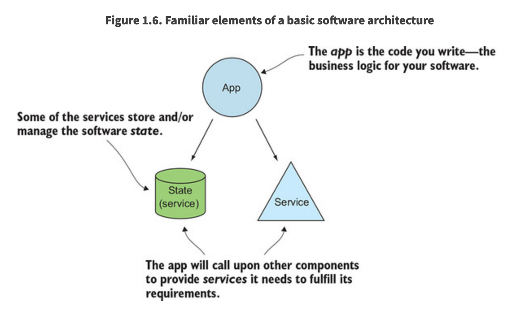
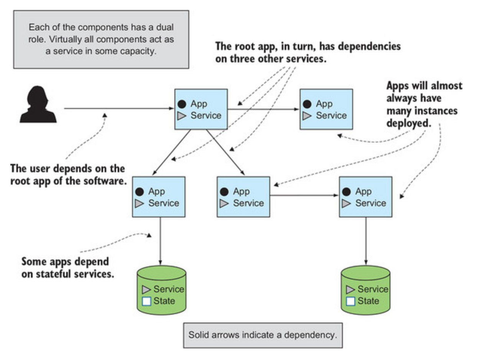
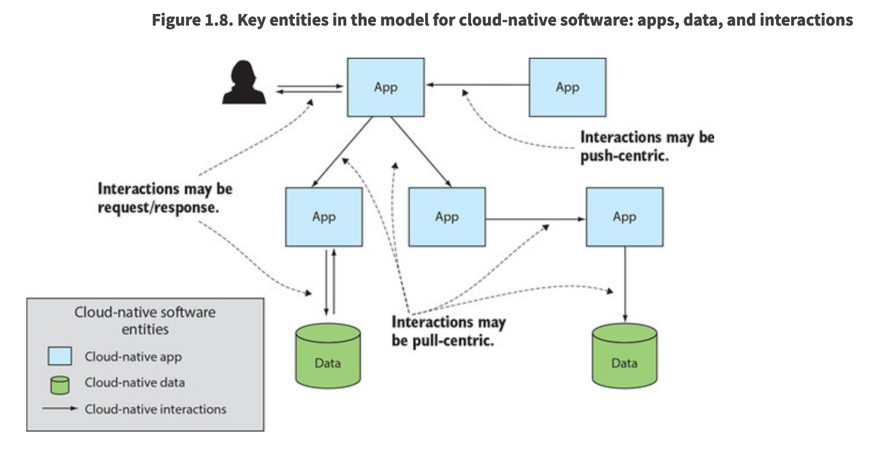
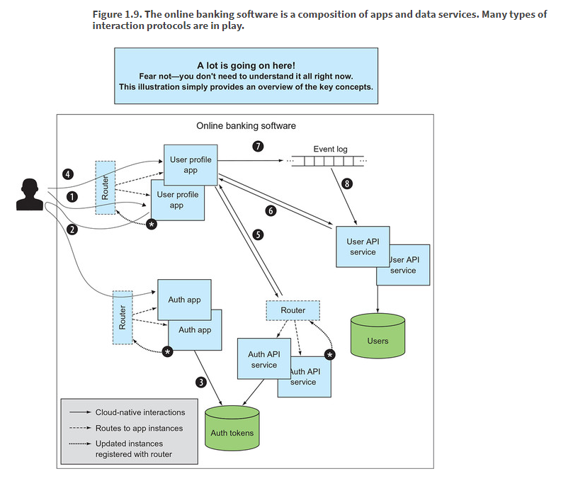
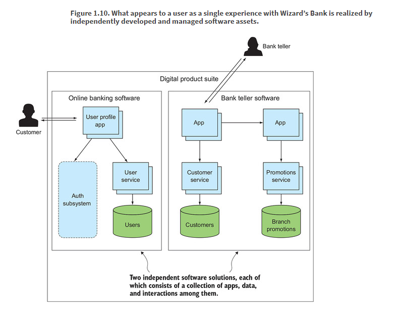
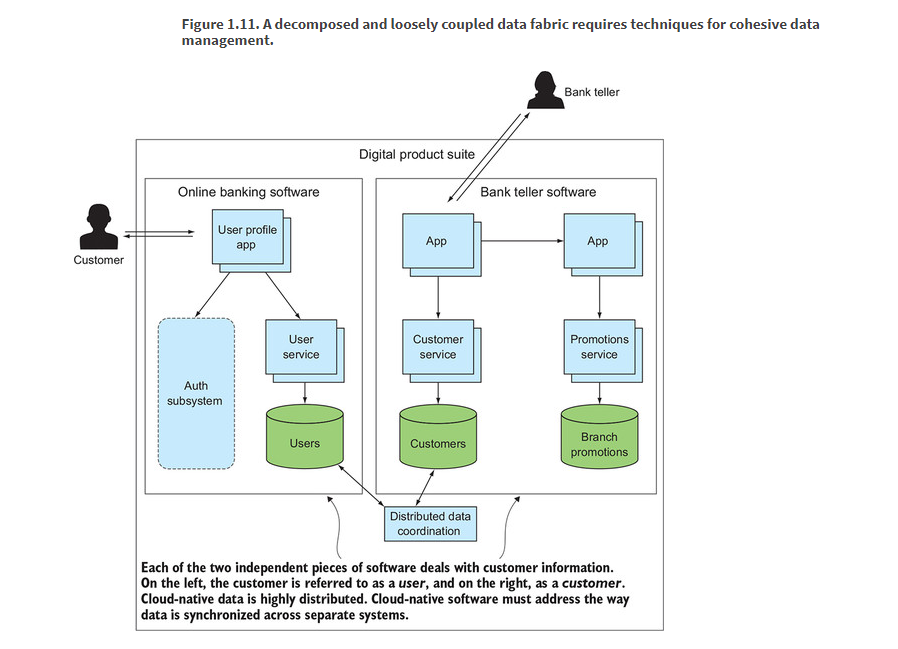
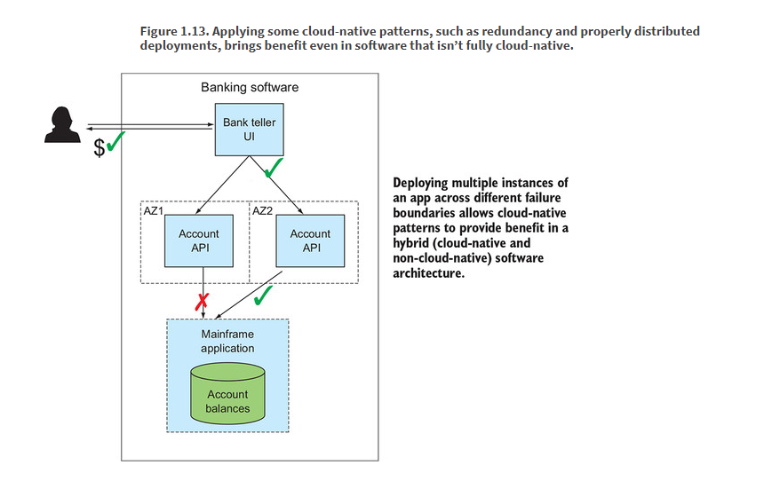

# Chapter 1 - You keep using that word: Defining “cloud-native”

No single piece of hardware can be guaranteed to be up 100% of the time, and, as has been the practice for some time, we put redundant systems are in place. AWS does exactly this and makes those redundancy abstractions available to its users.

In particular, AWS offers services in numerous regions; for example, at the time of writing, its Elastic Compute Cloud platform (EC2) is running and available in Ireland, Frankfurt, London, Paris, Stockholm, Tokyo, Seoul, Singapore, Mumbai, Sydney, Beijing, Ningxia, Sao Paulo, Canada, and in four locations in the United States (Virginia, California, Oregon, and Ohio). And within each region, the service is further partitioned into numerous availability zones (AZs) that are configured to isolate the resources of one AZ from another. This isolation limits the effects of a failure in one AZ rippling through to services in another AZ.

Cloud-native software is designed to anticipate failure and remain stable even when the infrastructure it’s running on is experiencing outages or is otherwise changing.

In the past, implementing these failover behaviors was generally a bespoke solution, bolted on to a deployment for a system that wasn’t initially designed to adapt to underlying system failures. The knowledge needed to achieve the required SLAs was often limited to a few “rock stars,” and extraordinary design, configuration, and testing mechanisms were put in place in an attempt to have systems that reacted appropriately to that failure.

The difference between this and what Netflix does today starts with a fundamental difference in philosophy. With the former approaches, change or failure is treated as an exception. By contrast, Netflix and many other large-scale internet-native companies, such as Google, Twitter, Facebook, and Uber, **treat change or failure as the rule**. These organizations have altered their software architectures and their engineering practices to make designing for failure an integral part of the way they build, deliver, and manage software.

## Today's Application Requirements

Digital experiences are no longer a sidecar to our lives. They play a major part in many or most of the activities that we engage in on a daily basis. This ubiquity has pushed the boundaries of what we expect from the software we use: we want applications to be always available, be perpetually upgraded with new whizbang features, and provide personalized experiences. Fulfilling these expectations is something that must be addressed right from the beginning of the idea-to-production lifecycle.

### Zero Downtime

The world is always online.

Maintaining uptime isn’t a problem only for the operations team. Software developers or architects are responsible for creating a system design with loosely coupled components that can be deployed to allow redundancy to compensate for inevitable failures, and with air gaps that keep those failures from cascading through the entire system. They must also design the software to allow planned events, such as upgrades, to be done with no downtime.

### Shortened Feedback Cycles

From the moment that you have an idea for a feature, you’re taking on some level of risk. Is the idea a good one? Will customers be able to use it? Can it be implemented in a better-performing way? As much as you try to predict the possible outcomes, reality is often different from what you can anticipate. The best way to get answers to important questions such as these is to release an early version of a feature and get feedback. Using that feedback, you can then make adjustments or even change course entirely. Frequent software releases shorten feedback loops and reduce risk.

### Mobile and Multidevice Support

Core services must be implemented in a manner that they can back all of the frontend devices serving users, and the system must adapt to expanding and contracting demands.

Internet-connected devices change the nature of the software we build in two fundamental ways. First, the volume of data flowing over the internet is dramatically increased. Billions of devices broadcast data many times a minute, or even many times a second. Second, in order to capture and process these massive quantities of data, the computing substrate must be significantly different from those of the past. It becomes more highly distributed with computing resources placed at the “edge,” closer to where the connected device lies. This difference in data volume and infrastructure architecture necessitates new software designs and practices.

### Data-driven

Instead of the single, shared database, these application requirements call for a network of smaller, localized databases, and software that manages data relationships across that federation of data management systems. These new approaches drive the need for software development and management agility all the way through to the data tier.

Finally, all of the newly available data is of little value if it goes unused. Today’s applications must increasingly use data to provide greater value to the customer through smarter applications. For example, mapping applications use GPS data from connected cars and mobile devices, along with roadway and terrain data to provide real-time traffic reports and routing guidance. The applications of the past decades that implemented painstakingly designed algorithms carefully tuned for anticipated usage scenarios are being replaced with applications that are constantly being revised or may even be self-adjusting their internal algorithms and configurations.

## Introducing Cloud-Native Software

### Defining "cloud native"

- Software that’s always up must be resilient to infrastructure failures and changes, whether planned or unplanned.
- Your goal is to release frequently, and monolithic software doesn’t allow this; too many interdependent pieces require time-consuming and complex coordination.
- No longer are users limited to accessing digital solutions when they sit in front of their computers. They demand access from the mobile devices they carry with them 24/7.
- Software that’s constructed as a set of independent components, redundantly deployed, implies distribution. If your redundant copies were all deployed close to one another, you’d be at greater risk of local failures having far-reaching consequences.
- Adaptable software is by definition “able to adjust to new conditions,” and the conditions I refer to here are those of the infrastructure and the set of interrelated software modules. They’re intrinsically tied together: as the infrastructure changes, the software changes, and vice versa.

Cloud native software, at its core, is **highly distributed and constantly changing**

### A mental model for cloud-native software

An app implements key business logic. This is where you’ll be writing the bulk of the code. This is where, for example, your code will take a customer order, verify that items are available in a warehouse’s inventory, and send a notification to the billing department.

The app, of course, depends on other components that it calls to either obtain information or take an action; I call these services. Some of the services store state—the warehouse inventory, for example. Others may be apps that implement the business logic for another part of your system—customer billing, for example.

Taking these simple concepts, let’s now build up a topology that represents the cloud-native software you’ll build; see figure 1.7. You have a distributed set of modules, most of which have multiple instances deployed. You can see that most of the apps are also acting as services, and further, that some services are explicitly stateful. Arrows depict where one component depends on another.

## Defining the three parts of cloud-native software

- **The cloud-native app** - Again, this is where you’ll write code; it’s the business logic for your software. Implementing the right patterns here allows those apps to act as good citizens in the composition that makes up your software; a single app is rarely a complete digital solution. An app is at one or the other end of an arrow (or both) and therefore must implement certain behaviors to make it participate in that relationship. It must also be constructed in a manner that allows for cloud-native operational practices such as scaling and upgrades to be performed.

- **Cloud-native data** - This is where state lives in your cloud-native software. Even this simple picture shows a marked deviation from the architectures of the past, which often used a centralized database to store state for a large portion of the software. For example, you might have stored user profiles, account details, reviews, order history, payment information, and more, all in the same database. Cloud-native software breaks the code into many smaller modules (the apps), and the database is similarly decomposed and distributed.

- **Cloud-native interactions** -  Cloud-native software is then a composition of cloud-native apps and cloud-native data, and the way those entities interact with one another ultimately determines the functioning and the qualities of the digital solution. Because of the extreme distribution and constant change that characterizes our systems, these interactions have in many cases significantly evolved from those of previous software architectures, and some interaction patterns are entirely new.

Concerns about cloud-native apps include the following:

- Their capacity is scaled up or down by adding or removing instances. We refer to this as *scale-out/in*, and it’s far different from the scale-up models used in prior architectures. When deployed correctly, having multiple instances of an app also offers levels of resilience in an unstable environment.
- As soon as you have multiple instances of an app, and even when only a single instance is being disrupted in some way, keeping state out of the apps allows you to perform recovery actions most easily. You can simply create a new instance of an app and connect it back to any stateful services it depends on.
- Configuration of the cloud-native app poses unique challenges when many instances are deployed and the environments in which they’re running are constantly changing. If you have 100 instances of an app, for example, gone are the days when you could drop a new config into a known filesystem location and restart the app. Add to that the fact that these instances could be moving all over your distributed topology. And applying such old-school practices to the instances as they are moving all over your distributed topology would be sheer madness.
- The dynamic nature of cloud-based environments necessitates changes to the way you manage the application lifecycle (not the software delivery lifecycle, but rather the startup and shutdown of the actual app). You must reexamine how you start, configure, reconfigure, and shut down apps in this new context.

Cloud-native data concerns:

- Breaking monoliths apart. You need to create a distributed data fabric, as you created a distributed app fabric.
- The distributed data fabric is made up of independent, fit-for-purpose databases (supporting polyglot persistence), as well as some that may be acting only as materialized views of data, where the source of truth lies elsewhere. Caching is a key pattern and technology in cloud-native software.
- When you have entities that exist in multiple databases, such as the “patient” I mentioned previously, you have to address how to keep the information that’s common across the different instances in sync.
- Ultimately, treating state as an outcome of a series of events forms the core of the distributed data fabric. Event-sourcing patterns capture state-change events, and the unified log collects these state-change events and makes them available to members of this data distribution.

Concerns for cloud-native interactions:

- Accessing an app when it has multiple instances requires some type of routing system. Synchronous request/response, as well as asynchronous event-driven patterns, must be addressed.
- In a highly distributed, constantly changing environment, you must account for access attempts that fail. Automatic retries are an essential pattern in cloud-native software, yet their use can wreak havoc on a system if not governed properly. Circuit breakers are essential when automated retries are in place.
- Because cloud-native software is a composite, a single user request is served through invocation of a multitude of related services. Properly managing cloud-native software to ensure a good user experience is a task of managing a composition—each of the services and the interactions between them. Application metrics and logging, things we’ve been producing for decades, must be specialized for this new setting.
- One of the greatest advantages of a modular system is the ability to more easily evolve parts of it independently. But because those independent pieces ultimately come together into a greater whole, the protocols underlying the interactions among them must be suitable for the cloud-native context; for example, a routing system that supports parallel deploys.

## Cloud-native software in action

- Example - bank software

- Sticky sessions are bad in cloud-native software

# Cloud-Native And World Peace

## Cloud and Cloud-native

When people say they're moving into the cloud, what they usually mean is they're moving into someone else's data center. But this won't bring better management practices, resilience, or more agility to the software delivery processes. SLAs for cloud services are almost always different from on-prem data centers, which can mean degredation in many respects.

Moving to the cloud doesn't make your software cloud-native.

*Cloud* is about *where* we're computing. *Cloud-native* is about *how*.

This means that you can implement cloud-native solutions on-prem.

### What isn't cloud native

Some common reasons for not going cloud-native:
- The software and computing infrastructure don’t call for cloud-native (e.g. IoT devices)
- Sometimes common characteristics of cloud-native software aren’t appropriate for the problem at hand (e.g. Needing strong consistency when cloud can only provide eventual consistency)
- Sometimes you have existing software that isn’t cloud-native, and there’s no immediate value in rewriting it. You should rewrite code only when there’s business value in doing so, and even when there is, you’re likely to have to prioritize such efforts, updating various offerings in your portfolio over several years.

### Cloud-native plays nice

# Summary

- Cloud-native applications can remain stable, even when the infrastructure they’re running on is constantly changing or even experiencing difficulties.
- The key requirements for modern applications call for enabling rapid iteration and frequent releases, zero downtime, and a massive increase in the volume and variety of the devices connected to it.
- A model for the cloud-native application has three key entities:
    - The cloud-native app
    - Cloud-native data
    - Cloud-native interactions
- Cloud is about where software runs; cloud-native is about how it runs.
- Cloud-nativeness isn’t all or nothing. Some of the software running in your organization may follow many cloud-native architectural patterns, other software will live on with its older architecture, and still others will be hybrids (a combination of new and old approaches).