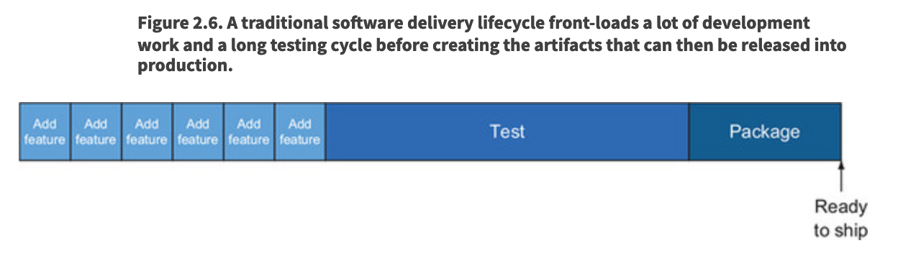

# Chapter 2 - Running cloud-native applications in production

Problem - deploying code to prod & maintaining it there is "somebody else's problem"

Solution - connect software dev practices & architctural patterns to the activities of deploying and maintaining code in prod

## The Obstacles

- Snowflakes - Variability across the software development lifecycle (SDLC) contributes to trouble with initial deployments as well as to a lack of stability after the apps are running. Inconsistencies in both the software artifacts being deployed and the environments being deployed to are the problem. 
- Risky deployments - The landscape in which software is deployed today is highly complex, with many tightly coupled, interrelated components. As such, a great risk exists that a deployment bringing a change in one part of that complex network will cause rippling effects in any number of other parts of the system. And fear of the consequences of a deployment has the downstream effect of limiting the frequency with which you can deploy. 
- Change is the exception - Over the last several decades, we generally wrote and operated software with the expectation that the system where it ran would be stable. This philosophy was probably always suspect. But now, with IT systems being complex and highly distributed, this expectation of infrastructure stability is a complete fallacy. As a result, any instability in the infrastructure propagates up into the running application, making it hard to keep running.
- Production instability - And finally, because deploying into an unstable environment is usually inviting more trouble, the frequency of production deployments is limited.

### Snowflakes

"It works on my machine"

Delay between time when software is ready for release and time when software is available to user causes:
- A difference in environments (e.g. - the version of Spring deployed to dev vs prod machines)
- A difference in the artifacts being deployed (e.g. environmental variables, config files)

### Risky deployments

Deployments are done at weird hours because they often are riddled with problems

Trying to mitigate the risk can have costs
- Having "environments just like production" means more server costs (and they aren't *really* like production)

The goal isn’t to solve this problem here, but rather to demonstrate that even an oversimplified scenario can quickly become extraordinarily complicated. I’m sure you can imagine that when you add more applications to the mix and/or try to test new versions of multiple applications in parallel, the process becomes completely intractable.

### Change is the exception

Runbooks gets handed over to ops, but they don't contain all the necessary information, failure scenarios, resolutions, etc.

### Production Instability

Lots of time spent fighting fires leaves little time for deployments

## The enablers

- Whereas snowflakes had previously contributed to slowness and instability, repeatability supports the opposite.
- Whereas risky deployments contributed to both production instability and challenging deployments, the ability to deploy safely drives agility and stability.
- Replacing practices and software designs that depend on an unchanging environment with ones that expect constant change radically reduces time spent fighting fires.

The companies that have been most successful with the new IT operations model have redesigned their entire SDLC processes with CD as the primary driver. This has a marked effect on the ease with which deployments can happen, and the benefits ripple through the entire system.

### Continuous Delivery (CD)

Continuous delivery doesn’t mean that every code change is deployed into production. Rather, it means that an as-new-as-possible version of the software is *deployable* at any time.

CD allows you more flexibility around when to release if features take longer than expected. If you're always in a state to ship after completing a feature, you can choose to keep a release date, but have a smaller amount of features. Or you can prolong the release date with the original amount of features if you wish. 

### Repeatability

To achieve the needed repeatability, you must be disciplined. In particular, you need to do the following:

- Control the environments into which you’ll deploy the software
- Control the software that you’re deploying—also known as the deployable artifact
- Control the deployment processes

In software, you use two primary mechanisms to consistently lay out the context in which the implementation runs. 

Standardized machine images
- Changes applied to that base image to establish the context into which your software is deployed must be coded (aka *infrastructure as code*)
Any changes to an environment must be equally controlled
- Only allow changes to the code that update the environments; don't let ops folks ssh into the machine and make changes manually

For efficient, safe, and repeatable production operations, it’s essential that a single deployable artifact is used through the entire SDLC. 

### Safe deployments

Experiment in production - safely

Use safety nets

- Parallel deployments and versioned services
- Generation of necessary telemetry
- Flexible routing

Instead of completely replacing one version of running software with a new version, you keep the known working version running as you add a new version to run alongside it. You start out with only a small portion of traffic routed to the new implementation, and you watch what happens. You can control which traffic is routed to the new implementation based on a variety of available criteria, such as where the requests are coming from (either geographically or what the referring page is, for example) or who the user is. 

Use your data to figure out if the new version is causing issues or not

Create smaller units of deployment

### Change is the rule

You need to let go of the notion of ever being done.

Let’s talk about eventual consistency. Rather than creating a set of instructions that brings a system into a “done” state, an eventually consistent system never expects to be done. Instead, the system is perpetually working to achieve equilibrium. The key abstractions of such a system are the desired state and the actual state.

The desired state of a system is what you want it to look like. For example, say you want a single server running a relational database, three application servers running RESTful web services, and two web servers delivering rich web applications to the users. These six servers are properly networked, and firewall rules are appropriately set. This topology is an expression of the desired state of the system. 

Eventual consistency is absolutely, totally, completely essential to running applications on the cloud.

Software designed to remain functional in the face of constant change is the Holy Grail, and the impact on system stability and reliability is obvious. A self-healing system maintains higher uptime than one that requires human intervention each time something goes wrong. And treating a deployment as an expression of a new desired state greatly simplifies it and reduces risk. Adopting a mindset that change is the rule fundamentally alters the nature of managing software in production. 