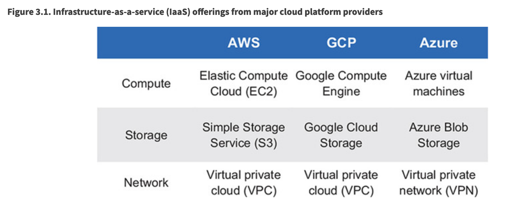

# Chapter 3 - The platform for cloud-native software 

## The Cloud(-Native) Platform Evolution

### It started with the cloud

AWS - 2006 - when cloud platforms first began in earnest

Took two years for competitors to have a response

Google - GAE
Microsoft - Medium Trust

### Cloud-native dial tone

Infrastructure-as-a-service (IaaS) platforms present *infrastructure dial tone:* an interface that provides access to hosts, storage, and networks—infrastructure primitives. 

The cloud-native platform presents *application dial tone:* an interface that makes the application the first-class entity that the developer or operator interacts with. 

Instead of deploying an app onto one or more hosts via IaaS interfaces, on the cloud-native platform an operator deploys an application, and the platform takes care of distributing the requested instances against available resources. Instead of configuring the firewall rules to secure the boundary of the hosts that are running a particular application, the operator applies a policy to the application, and the platform takes care of securing the application container. Instead of accessing hosts to get to logs for the app, the operator accesses the logs for the app. The experiential differences that a cloud-native platform offers over an IaaS platform are significant. 

## Core tenets of the cloud-native platform

### Containers

Starting at the most basic level, a *container* is a computing context that uses functionality from a host that it’s running on; for example, the base operating system. Generally, multiple containers are running on a single host, the latter of which is a server, either physical or virtual. These multiple containers are isolated from one another. At the highest level, they’re a bit like virtual machines (VMs), an isolated computing environment running on a shared resource. Containers, however, are lighter weight than VMs, allowing them to be created in orders of magnitude less time, and they consume fewer resources. 

When an application instance is to be run, a container is created on a host. All the bits necessary to run your app—the OS filesystem, application runtime, and the application itself—will be installed into that container and the appropriate processes started. The cloud-native platform, using containers at the core, provides a whole lot of functionality for your software, and creation of an app instance is but one. Others include the following:

- Monitoring the health of the application
- Appropriate distribution of app instances across the infrastructure
- Assignment of IP addresses to the containers
- Dynamic routing to app instances
- Injection of configuration
- And much more

Key points
1. Your infrastructure will have multiple hosts
2. A host has multiple containers running on it
3. Your app uses the OS and runtime environment installed into the container for its functionality

### Support for "constantly changing"

### Support for "highly distributed"

Service discovery

Service configuration

## Who does what?

Each team is responsible for deployment, configuration, monitoring, scaling, and upgrading its respective products. What differs are the products they’re responsible for and the tools they use to perform those duties. 

## More cloud-native platform capabilities

### The platform supports the entire SDLC

Each commit triggers a series of tests

Maybe once a day or so, a more comprehensive set of tests is run against changes

### Security, change-control, compliance (the control functions) 

If a deployment is guaranteed to meet the controls, you no longer have to go through a checklist before it happens. And if you no longer have a lengthy checklist, then the time from when you have your artifact ready to go to the time that it’s deployed shrinks dramatically. A deployment that once took days now takes minutes. And whereas a sequence of deployments took weeks, you can now complete several cycles within a single day. You can try things out and get feedback far more frequently than before, and you’ve already studied the many benefits of such a practice.

### Controlling what goes into the container 

Making the base image as small as possible is indeed a best practice, and making an attack surface smaller makes a system more secure. But security and compliance also come through ensuring that certain processes are guaranteed to run (logging agents, for example). Software packages that are required to run in every container should be included in the base image. 

- The platform should allow only approved base images to be used.
- The platform should control all runtime environments that may be included in a container.
- Build pipelines coupled with code scans to provide the automation to repeatably and safely create the artifact.

### Upgrading and patching vulnerabilities 

When any part of the application container needs to be updated, running instances aren’t modified. Instead, you deploy new containers with the new set of components. Because cloud-native apps always have multiple instances deployed, you can move from an old version to the new with zero downtime.

The basic pattern for such an upgrade is that (1) a subset of the app instances are shut down and disposed of, (2) an equal number of instances of the new container are launched, and (3) after they’re up and running, you move on to replacing the next batch of old instances. The cloud-native platform handles this process for you; you need only provide the new version of the app.

Look at the first few words of this section’s first paragraph: “When any part of the application container” needs to be updated—sometimes it’s the app that’s changing, and sometimes it’s all the pieces supplied by the platform. That’s right—the rolling upgrade is performed when you have a new version of your app, or whenever you have new versions of the operating system (kernel or root filesystem) or anything else in the runtime environment.

And it gets even better. The cloud-native platform, designed to serve both the platform and the app teams’ needs, allows these teams to operate independently. This is extraordinarily powerful! 

## Change control

The cloud-native platform allows for a fundamentally different way of addressing the concerns of change control. It provides the means of insulating components from one another, so that problems in one part of the data center will be kept from impacting others. 

