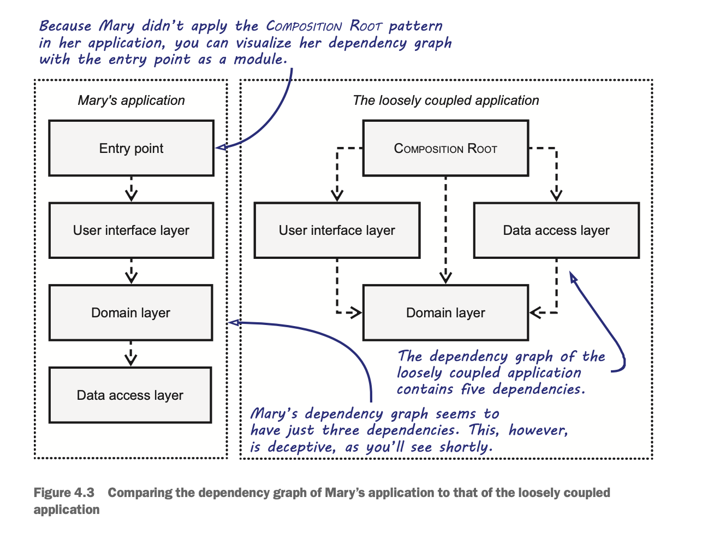
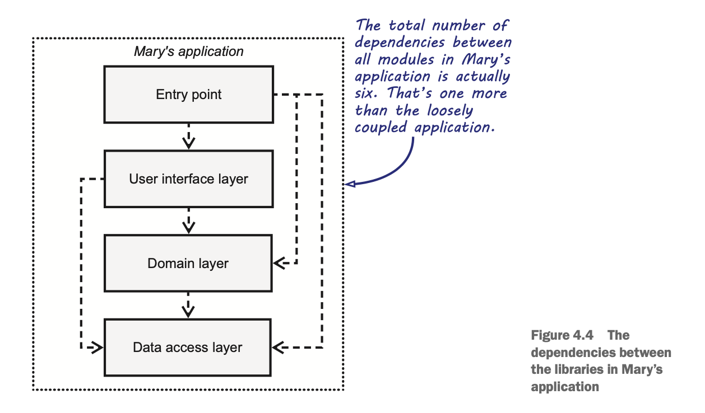

# Chapter 4 - DI Patterns

*Composition Root* — Describes where and how you should compose an application’s object graphs.

*Constructor Injection* — Allows a class to statically declare its required Dependencies.

*Method Injection* — Enables you to provide a Dependency to a consumer when either the Dependency or the consumer might change for each operation.

*Property Injection* — Allows clients to optionally override some class’s default behavior, where this default behavior is implemented in a Local Default.

## Composition Root

*Where should we compose object graphs?*

**As close as possible to the application’s entry point.**

**Definition** - A Composition Root is a single, logical location in an application where modules are composed together. 

Close to the application’s entry point, the Composition Root takes care of composing object graphs of loosely coupled classes. The Composition Root takes a direct dependency on all modules in the system.

**Warning** - If you use a DI Container, the Composition Root should be the only place where you use the DI Container. Using a DI Container outside the Composition Root leads to the Service Locator anti-pattern, which we discuss in the next chapter. 

Assemblies are a *deployment artifact*: you split code into multiple assemblies to allow code to be deployed separately. An architectural layer, on the other hand, is a *logical artifact*: you can group multiple logical artifacts in a single deployment artifact.

**Note** - Moving the composition of classes out of the Composition Root leads to either the Control Freak or Service Locator anti-patterns

Dependencies are transitive

The Composition Root pattern applies to all applications developed using DI, but only startup projects will have a Composition Root. A Composition Root is the result of removing the responsibility for the creation of Dependencies from consumers. To achieve this, you can apply two patterns: Constructor Injection and Property Injection. Constructor Injection is the most common and should be used almost exclusively.

## Constructor Injection

**Definition** -  *Constructor Injection* is the act of statically defining the list of required Dependencies by specifying them as parameters to the class’s constructor. 

**Important** - Constrain the design to a single (public) constructor. Because the constructor is the definition of a class’s Dependencies, it makes little sense to have multiple definitions. Overloaded constructors lead to ambiguity: which constructor should the caller (or a DI Container) use? 

**Important** Keep the constructor free of any other logic to prevent it from performing any work on Dependencies. The Single Responsibility Principle implies that members should do only one thing. Now that you’re using the constructor to inject Dependencies, you should keep it free of other concerns. This makes the construction of your classes fast and reliable. 

Constructor Injection should be your default choice for DI. It addresses the most common scenario where a class requires one or more Dependencies, and no reasonable Local Defaults are available.

**Definition** - A *Local Default* is a default implementation of a Dependency that originates in the same module or layer. 

**Warning** - A Local Default with Dependencies becomes a Foreign Default when one of its Dependencies is a Foreign Default. Transitivity strikes again. 

Constructor Injection is the most generally applicable DI pattern available, and also the easiest to implement correctly. It applies when the Dependency is required. If you need to make the Dependency optional, you can change to Property Injection if it has a proper Local Default.

**Warning** - Dependencies should hardly ever be optional. Optional Dependencies complicate the consuming component with null checks. Instead, make Dependencies required, and create and inject Null Object implementations in cases where there’s no reasonable implementation available for the required Dependency. 

## Method Injection

*How can we inject a Dependency into a class when it’s different for each operation?*

By supplying it as a method parameter.

**Definition** - Method Injection supplies a consumer with a Dependency by passing it as method argument on a method called outside the Composition Root. 

There are two typical use cases for applying Method Injection:
- When the consumer of the injected Dependency varies on each call
- When the injected Dependency varies on each call to a consumer

**The Temporal Coupling code smell**

Temporal Coupling is a common problem in API design. It occurs when there’s an implicit relationship between two or more members of a class, requiring clients to invoke one member before the other. This tightly couples the members in the temporal dimension. The archetypical example is the use of an Initialize method, although copious other examples can be found — even in the BCL

**Warning** - Don’t store injected method Dependencies. This leads to Temporal Coupling, Captive Dependencies, or hidden side effects.10  A method should use the Dependency or pass it on, and should refrain from storing such a Dependency. The use of Method Injection is quite common in the .NET BCL, so we’ll look at an example next.

**Note** - When we recommend that Constructor Injection should be your preferred DI pattern, we’re assuming that you generally build applications. On the other hand, if you’re building a framework, Method Injection can be useful because it lets the framework pass information about the context to add-ins. This is one reason why you see Method Injection used so prolifically in the BCL. But even in application code, Method Injection can be useful. 

## Property Injection

*How do we enable DI as an option in a class when we have a good Local Default?*

By exposing a writable property that lets callers supply a Dependency if they want to override the default behavior.

**Note** - In contrast to Constructor Injection, you can’t mark the Dependency property’s backing field as readonly, because you allow callers to modify the property at any given time during a consumer’s lifetime. 

### When to use Property Injection

Property Injection should only be used when the class you’re developing has a good Local Default, and you still want to enable callers to provide different implementations of the class’s Dependency. It’s important to note that Property Injection is best used when the Dependency is optional. If the Dependency is required, Constructor Injection is always a better pick.

DI lets you replace or Intercept classes to add or change behavior without either the consuming class nor its Dependency being aware of this. The Open/Closed Principle pushes you to a design where every new feature request can be addressed by creating one or more new classes or modules without touching any of the existing ones.

**Note** - When building applications, on the other hand, we never use Property Injection, and you should do so sparingly. Even though you might have a Local Default for a Dependency, Constructor Injection still provides you with a better alternative. Constructor Injection is simpler and more robust. You might think you need Property Injection to work around a cyclic Dependency, but that’s a code smell, as we’ll explain in chapter 6. 