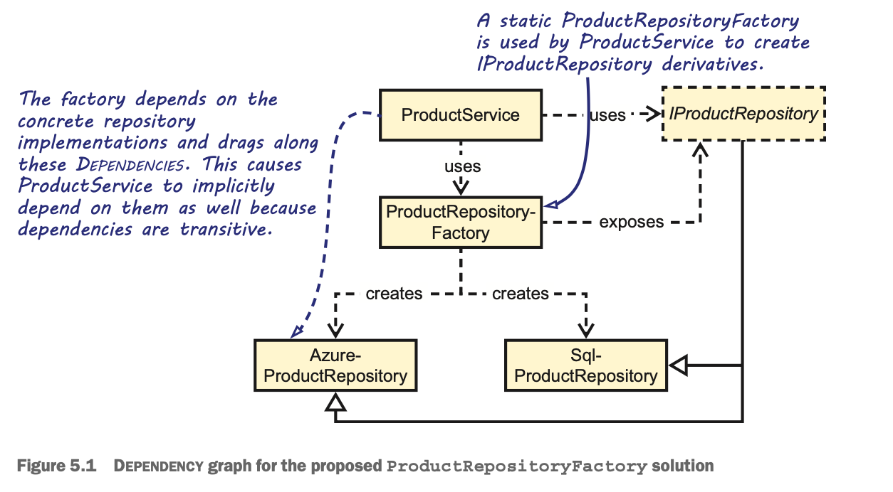

# Chapter 5 - DI Antipatterns

**DEFINITION** - An anti-pattern is a commonly occurring solution to a problem, which generates decidedly negative consequences, although other docu- mented solutions that prove to be more effective are available.

## Antipatterns

Control freak - As opposed to inversion of controL, Dependencies are controlled directly.

Service locator - An implicit service can serve DePenDencies to con- sumers, but it isn’t guaranteed to do so.

Ambient context - Makes a single Dependency available through a static accessor.

Constrained construction - Constructors are assumed to have a particular signature.

## Control freak

**DEFINITION** - The Control Freak anti-pattern occurs every time you depend on a Volatile Dependency in any place other than a Composition Root.

Every time you create a Volatile Dependency, you explicitly state that you’re going to control the lifetime of the instance and that no one else will get a chance to Intercept that particular object. Although the new keyword is a code smell when it comes to Vola- tile Dependencies, you don’t need to worry about using it for Stable Dependencies.

Static classes can also be Volatile Dependencies. Although you’ll never use the new keyword on a static class, depending on them causes the same problems.

### Concrete factory smell
Don’t conclude from this section that we generally oppose the use of Concrete Factory classes. A Concrete Factory can solve other problems, such as code repetition, by encapsulating complex creation logic. It, however, doesn’t provide any value with regards to DI. Use it when it makes sense.

### Abstract factory smell
Abstract Factory is one of the patterns from the original design patterns book.3 The Abstract Factory pattern is more common than you may realize. The names of the classes involved often hide this fact (for instance, by not ending in Factory). When it comes to DI, however, Abstract Factories are often overused. 

### Static factory smell




### Overloaded constructor smell

```
private readonly IProductRepository repository;

public ProductService() : this(new SqlProductRepository()) { }

public ProductService(IProductRepository repository)
{
  if (repository == null)
    throw new ArgumentNullException("repository");

  this.repository = repository;
}
```

Look for occurrences of the `new` keyword next to Volatile Dependencies. 

Control Freak is the most common DI anti-pattern. It represents the default way of creating instances in most programming languages, so it can be observed even in applications where developers have never considered DI. It’s such a natural and deeply rooted way to create new objects that many developers find it difficult to discard. Even when they begin to think about DI, they have a hard time shaking the mindset that they must somehow control when and where instances are created. Letting go of that control can be a difficult mental leap to make; but, even if you make it, there are other, although lesser, pitfalls to avoid.

### Negative Effects of Control Freak Antipattern

- Although you can configure an application to use one of multiple preconfigured DepenDen- cieS, you can’t replace them at will.
- It becomes harder to reuse the consuming module because it drags with it DepenDencieS that may be undesirable in the new context.
- It makes parallel development more difficult. 
- Testability suffers. 

### Refactoring away from Control Freak towards DI

```
public class ProductService : IProductService
{
    private readonly IProductRepository repository;

    public ProductService(IProductRepository repository)
    {
      if (repository == null)
        throw new ArgumentNullException("repository");

      this.repository = repository;
    }
}
```

## Service Locator

