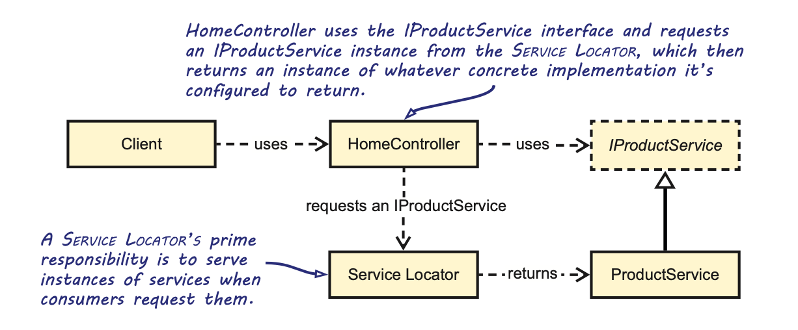

# Chapter 5 - DI Antipatterns

**DEFINITION** - An anti-pattern is a commonly occurring solution to a problem, which generates decidedly negative consequences, although other docu- mented solutions that prove to be more effective are available.

## Antipatterns

Control freak - As opposed to inversion of controL, Dependencies are controlled directly.

Service locator - An implicit service can serve DePenDencies to con- sumers, but it isn’t guaranteed to do so.

Ambient context - Makes a single Dependency available through a static accessor.

Constrained construction - Constructors are assumed to have a particular signature.

## Control freak

**DEFINITION** - The Control Freak anti-pattern occurs every time you depend on a Volatile Dependency in any place other than a Composition Root.

Every time you create a Volatile Dependency, you explicitly state that you’re going to control the lifetime of the instance and that no one else will get a chance to Intercept that particular object. Although the new keyword is a code smell when it comes to Vola- tile Dependencies, you don’t need to worry about using it for Stable Dependencies.

Static classes can also be Volatile Dependencies. Although you’ll never use the new keyword on a static class, depending on them causes the same problems.

### Concrete factory smell
Don’t conclude from this section that we generally oppose the use of Concrete Factory classes. A Concrete Factory can solve other problems, such as code repetition, by encapsulating complex creation logic. It, however, doesn’t provide any value with regards to DI. Use it when it makes sense.

### Abstract factory smell
Abstract Factory is one of the patterns from the original design patterns book.3 The Abstract Factory pattern is more common than you may realize. The names of the classes involved often hide this fact (for instance, by not ending in Factory). When it comes to DI, however, Abstract Factories are often overused. 

### Static factory smell


### Overloaded constructor smell

```
private readonly IProductRepository repository;

public ProductService() : this(new SqlProductRepository()) { }

public ProductService(IProductRepository repository)
{
  if (repository == null)
    throw new ArgumentNullException("repository");

  this.repository = repository;
}
```

Look for occurrences of the `new` keyword next to Volatile Dependencies. 

Control Freak is the most common DI anti-pattern. It represents the default way of creating instances in most programming languages, so it can be observed even in applications where developers have never considered DI. It’s such a natural and deeply rooted way to create new objects that many developers find it difficult to discard. Even when they begin to think about DI, they have a hard time shaking the mindset that they must somehow control when and where instances are created. Letting go of that control can be a difficult mental leap to make; but, even if you make it, there are other, although lesser, pitfalls to avoid.

### Negative Effects of Control Freak Antipattern

- Although you can configure an application to use one of multiple preconfigured DepenDen- cieS, you can’t replace them at will.
- It becomes harder to reuse the consuming module because it drags with it DepenDencieS that may be undesirable in the new context.
- It makes parallel development more difficult. 
- Testability suffers. 

### Refactoring away from Control Freak towards DI

```
public class ProductService : IProductService
{
    private readonly IProductRepository repository;

    public ProductService(IProductRepository repository)
    {
      if (repository == null)
        throw new ArgumentNullException("repository");

      this.repository = repository;
    }
}
```

## Service Locator

**DEFINITION** - A Service Locator supplies application components outside the Composition Root with access to an unbounded set of Volatile Dependencies.

As it’s most commonly implemented, the Service Locator is a Static Factory that can be configured with concrete services before the first consumer begins to use it.

```
public class HomeController : Controller { }

public HomeController() { }

public ViewResult Index()
{
  IProductService service = Locator.GetService<IProductService>();
  var products = service.GetFeaturedProducts();

  return this.View(products);
}
```




### Analysis of Service Locator

Service Locator is a dangerous pattern because it almost works. You can locate Dependencies from consuming classes, and you can replace those Dependencies with different implementations—even with Test Doubles from unit tests. 

### Negative Effects of Service Locator

The main problem with Service Locator is that it impacts the reusability of the classes consuming it. This manifests itself in two ways:
  - The class drags along the Service Locator as a redundant Dependency.
  - The class makes it non-obvious what its Dependencies are.

The ProductService class is far from self documenting: you can’t tell which Dependencies must be present before it’ll work. In fact, the developers of ProductService may even decide to add more Dependencies in future versions. That would mean that the code that works for the current version can fail in a future version, and you aren’t going to get a compiler error that warns you. Service Locator makes it easy to inad- vertently introduce breaking changes.

When unit testing, you have the additional problem that a Test Double registered in one test case will lead to the Interdependent Tests code smell, because it remains in memory when the next test case is executed. It’s therefore necessary to perform Fixture Teardown after every test by invoking Locator.Reset().8 This is something that you must manually remember to do, and it’s easy to forget.

A Service Locator may seem innocuous, but it can lead to all sorts of nasty runtime errors. How do you avoid those problems? When you decide to get rid of a Service Locator, you need to find a way to do it. As always, the default approach should be Constructor Injection, unless one of the other DI patterns from chapter 4 provides a better fit.

### Refactoring away from Service Locator

In many cases, a class that consumes a Service Locator may have calls to it spread throughout its code base. In such cases, it acts as a replacement for the new statement. When this is so, the first refactoring step is to consolidate the creation of each Depen- dency in a single method.

If you don’t have a member field to hold an instance of the Dependency, you can introduce such a field and make sure the rest of the code uses this field when it con- sumes the Dependency. Mark the field readonly to ensure that it can’t be modified out- side the constructor. Doing so forces you to assign the field from the constructor using the Service Locator. You can now introduce a constructor parameter that assigns the field instead of the Service Locator, which can then be removed.

Introducing a Dependency parameter to a constructor is likely to break existing consumers, so it’s best to start with the top-most classes and work your way down the Dependency graph.

## Ambient Context

**Definition** - An Ambient Context supplies application code outside the Composition Root with global access to a Volatile Dependency or its behavior by the use of static class members.

Ambient Context is similar in structure to the Singleton pattern. Both allow access to a Dependency by the use of static class members. The difference is that Ambient Context allows its Dependency to be changed, whereas the Singleton pattern ensures that its singular instance never changes.

**NOTE** - The Singleton pattern should only be used either from within the Composition Root or when the Dependency is Stable. On the other hand, when the Singleton pattern is abused to provide the application with global access to a Volatile Dependency, its effects are identical to those of the Ambient Context, as discussed in section 5.3.3.

Other variations of Ambient Context:

- An ambient context that allows consumers to make use of the behavior of a globally configured DepenDency. With the previous example in mind, the TimeProvider could supply consumers with a static GetCurrentTime method that hides the used Dependency by calling it internally.
- An ambient context that merges the static accessor with the interface into a single abStraction. In respect to the previous example, that would mean that you have a single TimeProvider base class that contains both the Now instance property and the static Current property.
- An ambient context where delegates are used instead of a custom-defined abStraction. Instead of having a fairly descriptive ITimeProvider interface, you could achieve the same using a Func<DateTime> delegate.

Jeff Atwood - Logging:

- Logging means more code, which obscures your application code.
- Logging isn’t free, and logging a lot means constantly writing to disk. 
- The more you log, the less you can find.
- If it’s worth saving to a log file, it’s worth showing in the user interface.

### Negative effects of Ambient Context

- The Dependency is hidden.
- Testing becomes more difficult.
- It becomes hard to change the Dependency based on its context.
- There’s Temporal Coupling between the initialization of the Dependency and
its usage.

When a class has many Dependencies, it’s an indication that it’s doing more than it should. It’s theoretically possible to have a class with many Dependencies, while still having just “one reason to change.” The larger the class, however, the less likely it is to abide by this guidance. The use of Ambient Context hides the fact that classes might have become too complex, and need to be refactored.

### Refactoring from Ambient Context toward DI

A class that consumes an Ambient Context typically contains one or a few calls to it, possibly spread over multiple methods. Because the first refactoring step is to centralize the call to the Ambient Context, the constructor is a good place to do this.

Create a private readonly field that can hold a reference to the Dependency and assign it with the Ambient Context’s Dependency. The rest of the class’s code can now use this new private field. The call to the Ambient Context can now be replaced with a constructor parameter that assigns the field and a Guard Clause that ensures the constructor parameter isn’t null. This new constructor parameter will likely cause consumers to break. But if DI was applied already, this should only cause changes to the Composition Root and the class’s tests.

## Constrained Construction

**Definition** - Constrained Construction forces all implementations of a cer- tain Abstraction to require their constructors to have an identical signature with the goal of enabling late binding.

Instead of imposing implicit constraints on how objects should be constructed, you should implement your Composition Root so that it can deal with any kind of con- structor or factory method you may throw at it. Now let’s take a look at how you can refactor toward DI.

Using a DI Container can be an effective solution to prevent Constrained Construction.
