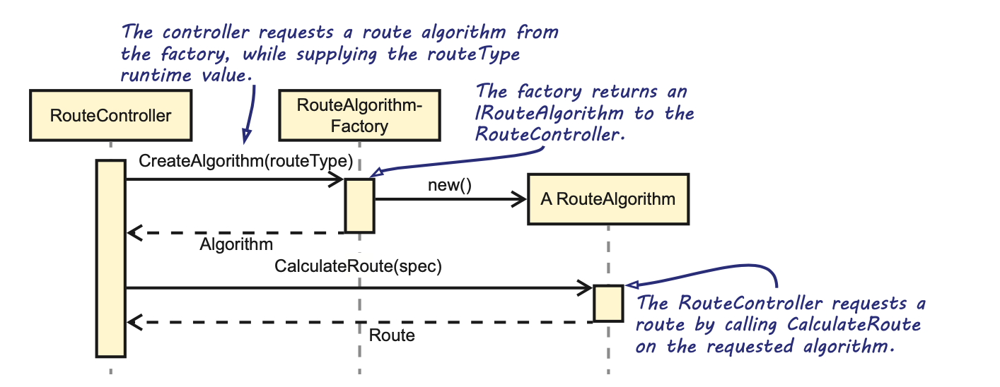
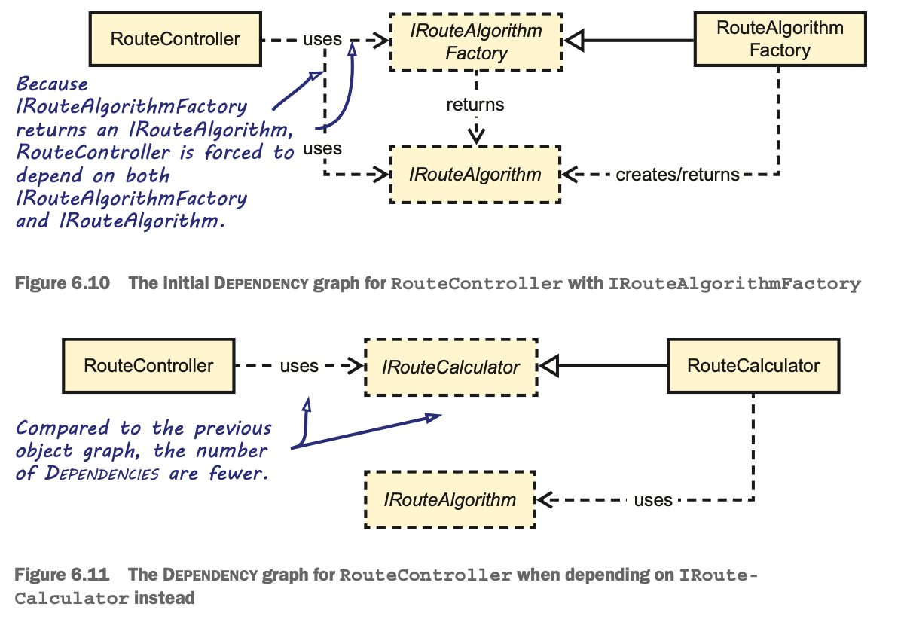
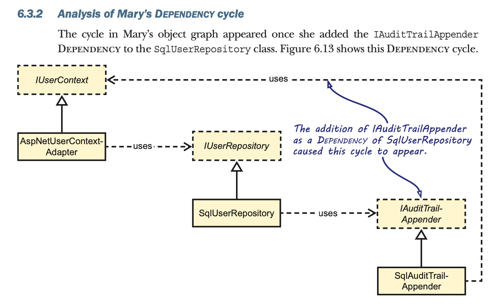
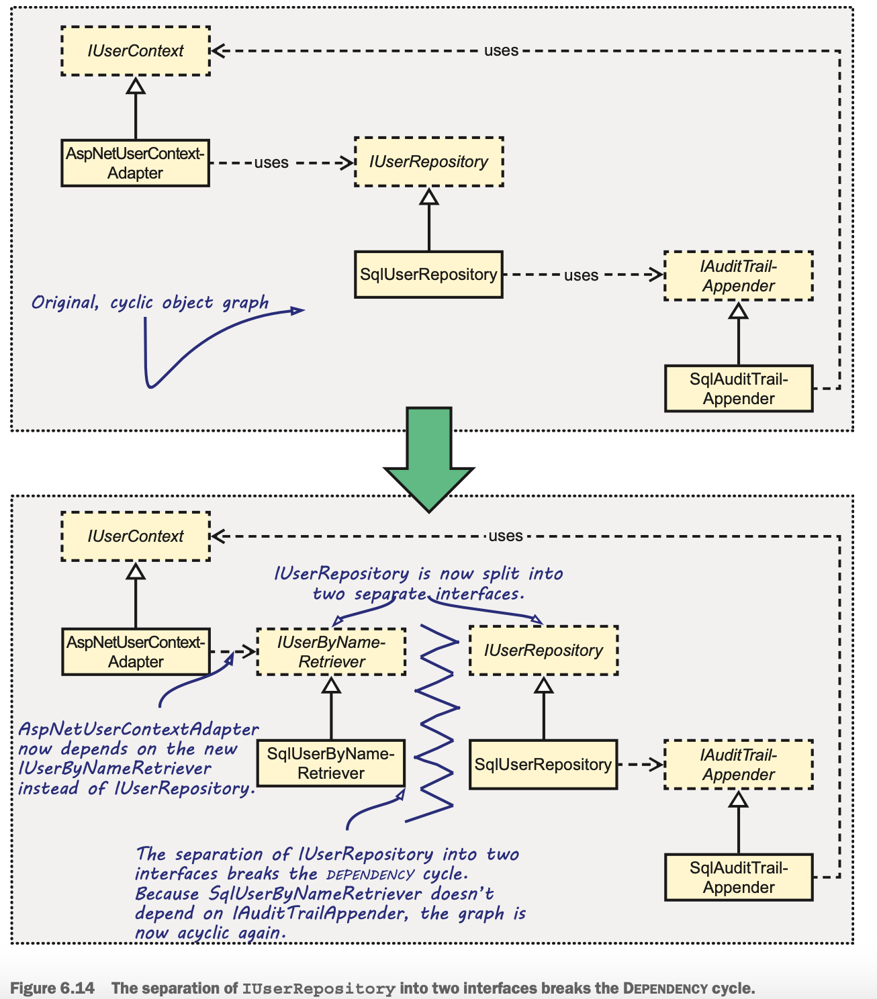
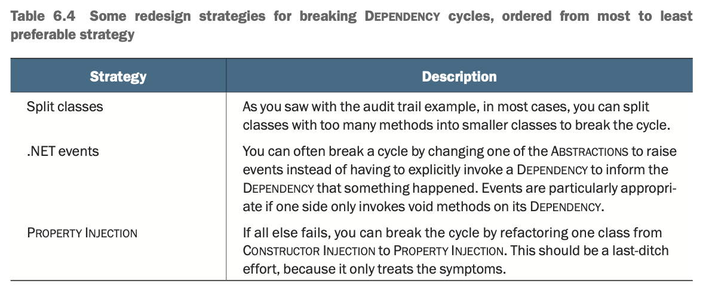

# Chapter 6 - Code Smells

**Definition** - “A code smell is a hint that something might be wrong, not a cer- tainty. A perfectly good idiom may be considered a code smell because it’s often misused, or because there’s a simpler alternative that works better in most cases. Calling something a code smell is not an attack; it’s a sign that a closer look is warranted.” (http://wiki.c2.com/?CodeSmell)

Where an anti-pattern is a description of a commonly occurring solution to a problem that generates decidedly negative consequences, a code smell, on the other hand, is a code construct that might cause problems. Code smells simply warrant further investigation.

## Recognizing Construction Over-Injection

 You can refactor away from Constructor Over-injection in many ways, so we’ll also discuss two common approaches you can take to refactor those occurrences, namely, Facade Services and domain events:

- Facade Services are abstract Facades that are related to Parameter Objects. Instead of combining components and exposing them as parameters, however, a Facade Service exposes only the encapsulated behavior, while hiding the constituents.
- With domain events, you capture actions that can trigger a change to the state of the application you’re developing.

**NOTE** - Constructor Injection makes it easy to spot SRP violations. Instead of feeling uneasy about Constructor Over-injection, you should embrace it as a fortunate side effect of Constructor Injection. It’s a signal that alerts you when a class takes on too much responsibility.

**Definition** - A Facade Service hides a natural cluster of interacting Dependencies, along with their behavior, behind a single Abstraction.

**Tip** - Refactoring to Facade Services is more than just a party trick to get rid of
too many Dependencies. The key is to identify natural clusters of interaction.

A beneficial side effect is that discovering these natural clusters draws previously undiscovered relationships and domain concepts out into the open. In the process, you turn implicit concepts into explicit concepts.

### Using Domain Events to Deal With Constructor Over-Injection

**Definition** - The essence of a domain event is that you use it to capture actions that can trigger a change to the state of the application you’re developing (https://martinfowler.com/eaaDev/DomainEvent.html).

### Reliable messaging

Promoting domain events to types in your system has more benefits than just improving the maintainability of the application. Consider the following scenario.

At peak hours, the web services of the warehouses may time out. But at that point in time, both the receipt has been sent and the billing system has been notified. Although it’s possible to roll back the database update, it’s impossible to roll back the notification — the customer has already been mailed.

Unfortunately, the problems with the billing system aren’t the only ones. Recently, one of the web servers that runs the order-approval process crashed. The customer’s confirma- tion mail got sent just before the crash, but neither the billing system nor the warehouses were notified. The customer never got the order. What should you do to mitigate these kinds of problems?

Although there are multiple ways to handle this scenario, domain events can help: they can be serialized and put on a durable message queue like MSMQ, Azure Queue, or a database table. Doing so allows you to let your OrderService only execute the following operations:
- Begin a transaction
- Update the order in the database as part of the transaction
- Publish the OrderAccepted event to a durable queue as part of the transaction
- Commit the transaction

Only after the OrderAccepted event has been committed to the queue does it become available for further processing. At that point, you can pass it on to each of the available handlers for that particular event. Each handler can run in its own isolated transaction. If one of the handlers fails, you could retry that specific handler without influencing the other handlers. You might even execute multiple handlers in parallel.

Processing messages using a durable queue is a form of reliable messaging. Reliable messaging gives certain guarantees about the successful transmission of messages. It’s an effective solution for the scenario described, where servers can crash and external systems can become unavailable. As you can imagine, though, how to implement these reliable messaging patterns is outside the scope of this book.

## Abuse of Abstract Factories

Although Abstract Factories do have their place in software, when it comes to DI — when factories are used as DEPENDENCIES in application components — they're often overused. 

Just as Test-Driven Development (TDD) ensures Testability, it’s safest to define inter- faces first and then subsequently program against them. Even so, there are cases where you already have a concrete type and now want to extract an interface. When you do this, you must take care that the underlying implementation doesn’t leak through. One way this can happen is if you only extract an interface from a given concrete type, but some of the parameter or return types are still concrete types defined in the library you want to abstract from. 

If you need to extract an interface, you need to do it in a recursive manner, ensuring that all types exposed by the root interface are themselves interfaces. We call this Deep Extraction, and the result is Deep Interfaces.

This doesn’t mean that interfaces can’t expose any concrete classes. It’s typically fine to expose behaviorless data objects, such as Parameter Objects, view models, and Data Transfer Objects (DTOs). They’re defined in the same library as the interface instead of the library you want to abstract from. Those data objects are part of the Abstraction.

### Abstractions that implement IDisposable are Leaky Abstractions

Application code shouldn’t be responsible for the management of the lifetime of objects. Putting this responsibility inside the application code means you increase complexity of that particular class and make it more complicated to test and maintain. We often see Lifetime management logic duplicated across the application, instead of being centralized in the comPosition root, which is what you’re aiming for.

DI is no excuse for writing applications with memory leaks, so you must be able to explicitly close connections and other resources as soon as possible. On the other hand, any dependency may or may not represent an out-of-process resource, so it would be a Leaky Abstraction if you were to model an AbstrAction to include a Dispose or Close method.

An abstraction generally shouldn’t be disposable, as there’s no way to foresee all of its possible implementations. Practically, any abstraction could end up requiring a disposable implementation at some point, whereas other implementations of the same abstraction continue relying exclusively on managed code.

This doesn’t mean that classes shouldn’t implement IDisposable. What this does mean, however, is that abstractions shouldn’t implement IDisposable. Because the client only knows about the abstraction, it can’t be responsible for managing the lifetime of that instance. We move this responsibility back to the comPosition root.

### Proxy design pattern

The Proxy design pattern provides a surrogate or placeholder for another object to control access to it. It allows deferring the full cost of its creation and initialization until you need to use it. A Proxy implements the same interface as the object it’s surrogate for. It makes consumers believe they’re talking to the real implementation.

### Abusing Abstract Factories to select dependencies based on runtime data

In chapter 3 (section 3.1.2), we talked about the Dependency Inversion Principle. We discussed how it states that **Abstractions should be owned by the layer using the Abstraction**. We explained that **it’s the consumer of the Abstraction that should dictate its shape and define the Abstraction in a way that suits its needs the most**. When we go back to our RouteController and ask ourselves whether this is the design that suits RouteController the best, we’d argue that this design doesn’t suit RouteController.

By refactoring from Abstract Factory to an Adapter, you effectively reduce the num- ber of Dependencies between your components. Figure 6.10 shows the Dependency graph of the initial solution using the Factory, while figure 6.11 shows the object graph after refactoring.

## Fixing Cyclic Dependencies

Dependency cycles are typically caused by an SRP violation.

**NOTE** - Ever-changing Abstractions are a strong indication of SRP violations. This also relates to the Open/Closed Principle (OCP) as discussed in chap- ter 4, which states that you should be able to add features without having to change existing classes.

**NOTE** - The more methods a class has, the higher the chance it violates the Single Responsibility Principle. This is also related to the Interface Segregation Principle, which prefers narrow interfaces.

The most common cause of Dependency cycles is an SRP violation. Fixing the viola- tion by breaking classes into smaller, more focused classes is typically a good solution, but there are also other strategies for breaking Dependency cycles.

**WARNING** - Only resort to solving cycles by using Property Injection as a last- ditch effort. It only treats the symptoms instead of curing the illness.

Always keep in mind that the best way to address a cycle is to redesign the API so that the cycle disappears. But in the rare cases where this is impossible or highly undesir- able, you must break the cycle by using Property Injection in at least one place. This enables you to compose the rest of the object graph apart from the Dependency associated with the property. When the rest of the object graph is fully populated, you can inject the appropriate instance via the property. Property Injection signals that a Dependency is optional, so you shouldn’t make the change lightly.