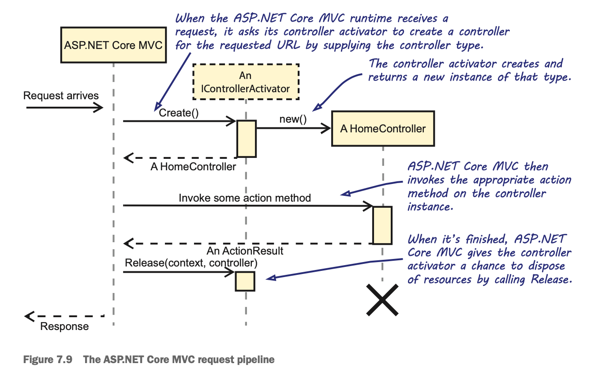

# Chapter 7 - Application Composition

**DEFINITION** - Object Composition is the act of building up hierarchies of related components. This composition takes place inside the Composition Root.

**NOTE** - In .NET Core, a console application is a .dll (not an .exe) that can be started by running the dotnet command with the name of the DLL as the first argument.

## Composing Console Applications

## Composing UWP Applications

### What's a UWP application?

The Universal Windows Platform (UWP) is the application platform for Windows 10. You can develop apps for UWP with just one API set, one application package, and one store to reach all Windows 10 devices (PC, tablet, phone, Xbox, HoloLens, Surface Hub, and more). It’s easier to support a number of screen sizes and a variety of interaction models, whether it be touch, mouse and keyboard, a game controller, or a pen. At the core of UWP applications is the idea that users want their experiences to be common across all their devices, and they want to use whatever device is most convenient or productive for the task at hand.

### MVVM

Model-View-ViewModel (MVVM) is a design pattern for which UWP is particularly well suited. It divides UI code into three distinct responsibilities:
- The Model is the underlying model for the application. This is often, but not always, the domain model. It frequently consists of Plain Old CLR Objects (POCOs). Notice that the Model is usually expressed in a UI-neutral way; it doesn’t assume that it’ll be exposed directly by a UI, so it doesn’t expose any UWP-specific functionality.
- The View is the UI we look at. In UWP, you can declaratively express the View in XAML and use data binding and data templating to present the data. It’s possible to express the views without the use of code-behind, and, in fact, it’s often preferred, as it helps keep the views focused exclusively on UI.
- The ViewModel is the bridge between the View and the Model. Each ViewModel is a class that translates and exposes the Model in a technology-specific way. In UWP, this means it may expose lists as System.Collections.ObjectModel .ObservableCollection, user actions as System.Windows.Input.ICommand, and so on.

The role of the ViewModel in MVVM is different from the View Model in an MVC application. With MVC, the View Model is a behaviorless data object and is newed up in your application code. MVVM ViewModels, on the other hand, are components with Dependencies. In your UWP application, ViewModels will be composed using DI.

**NOTE** - An important part of the Composition Root is the Composer. It’s a unifying term to refer to any object or method that composes Dependencies and is discussed in more detail in the next chapter.

## Composing ASP.NET Core MVC applications

**NOTE** - In ASP.NET “classic,” Microsoft developed separate frameworks for MVC and Web API. With ASP.NET Core, Microsoft created one unifying frame- work to handle both MVC and Web API under the umbrella of ASP.NET Core MVC. From the perspective of DI, wiring a Web API is identical to an MVC application in ASP.NET Core. This means that this section applies to building Web APIs in .NET Core too.

Controllers are central to ASP.NET Core MVC. They handle requests and determine how to respond. If you need to query a database, validate and save incoming data, invoke domain logic, and so on, you initiate such actions from a controller. A controller shouldn’t do such things itself, but rather delegate the work to the appropriate Dependencies. This is where DI comes in.

Creating a custom controller activator isn’t particularly difficult. It requires you to implement the IControllerActivator interface.

A custom controller activator can be added as part of the application startup sequence — usually in the Startup class. They’re used by calling AddSingleton<IController­ Activator> on the IServiceCollection instance. 