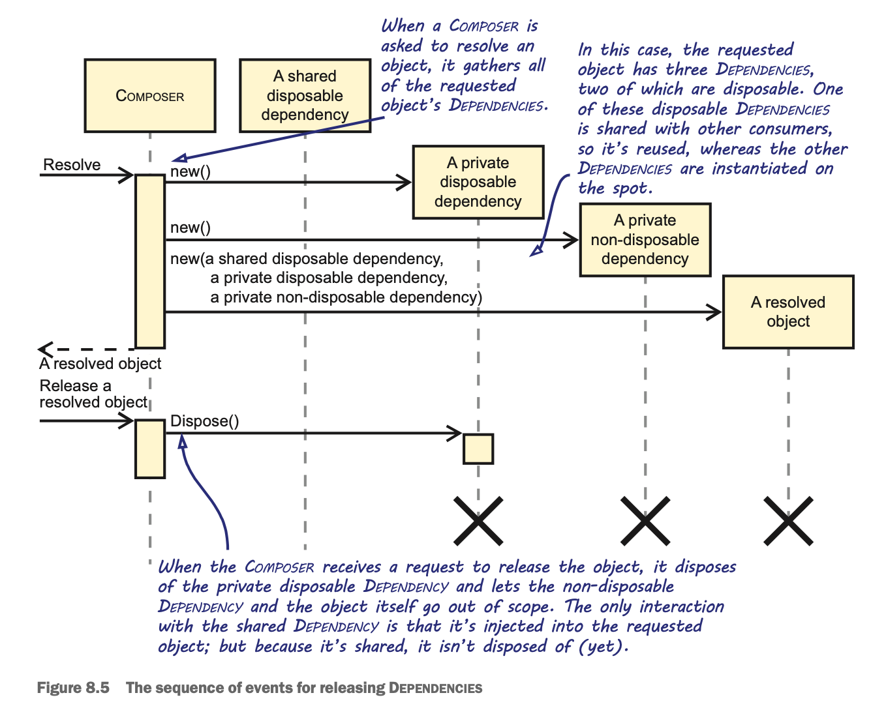

# Chapter 8 - Object Lifetime

**DEFINITION** - Composer is a unifying term to refer to any object or method that composes Dependencies. It’s an important part of the Composition Root. The Composer is often a DI Container, but it can also be any method that constructs object graphs manually (using Pure DI).

**DEFINITION** - A Lifestyle is a formalized way of describing the intended lifetime of a Dependency. 

## Managing Dependency Lifetime

When we accept that we should let go of our psychological need for control over Dependencies and instead request them through Constructor Injection or one of the other DI patterns, we must let go completely. 

Consumers don’t control creation of their Dependencies, but what about destruc- tion? As a general rule, you don’t control when objects are destroyed in .NET. The garbage collector cleans up unused objects, but unless you’re dealing with disposable objects, you can’t explicitly destroy an object.

**NOTE** - We use the term disposable object as shorthand for referring to object instances of types that implement the IDisposable interface.

### Liskov Substitution Principle

As it was originally stated, the Liskov substitution Principle is an academic and abstract concept defined by Barbara Liskov in 1987. But in object-oriented design, we can para- phrase it as follows: “Methods that consume AbstrActions must be able to use any class derived from that Abstraction without noticing the difference.”

We must be able to substitute the Abstrlction for an arbitrary implementation without changing the correctness of the system. Failing to adhere to the Liskov substitution Principle makes applications fragile, because it disallows replacing Dependencies, and doing so might cause a consumer to break.

**DEFINITION** - Releasing is the process of determining which Dependencies can be dereferenced and possibly disposed of. The Composition Root requests an object graph from the Composer. After the Composition Root has finished working with that resolved graph, it informs the Composer that it has finished with the graph. The Composer can then decide which of the Dependencies of that particular graph can be released.

## Working with disposable dependencies

**DEFINITION** - An ephemeral disposable is an object with a clear and short lifetime that typically doesn’t exceed a single method call.

**WARNING** - An object might require its Dependencies to be called during disposal, which causes problems when these Dependencies are already disposed of. Disposal should therefore happen in the opposite order of creation — this means from the outside in.

### Should I dispose a DbContext?

CommerceContext is our project-specific version of Entity Framework Core’s DbContext, which implements IDisposable. In the past, we’ve witnessed many discussions with colleagues and developers on online forums about the need to dispose of DbContext instances. These discussions typically came from the observation that a DbContext uses database connections as ephemeral disposables; connections are opened and closed in the same method call. Calling SaveChanges on DbContext, for instance, creates and opens a database connection, and then disposes of that connection once all changes are saved.

Well, things have changed in Entity Framework Core 2.0. With the introduction of version 2, it now supports DbContext pooling, a feature similar to ADO.NET’s connection pooling. It allows the same DbContext instance to be reused, which can improve application performance under certain conditions. DbContext instances, however, are returned back to their pool when Dispose is called, so not calling Dispose on a DbContext instance might starve the pool.

The moral of this story is that you should always make sure disposable objects are cor- rectly disposed of. Even if you determined that you could omit a call to Dispose in your specific case, an external component, such as Entity Framework Core, is free to change that behavior any time in the future.

**TIP** - DI Containers are particularly good at Lifetime Management. DI Containers can deal with complex combinations of Lifestyles, and they offer opportunities, such as a Release method, to explicitly release components when you’re finished with them. When you find yourself in the situation where maintaining your Composition Root using Pure DI becomes difficult, consider switching to a DI Container instead. (We’ll go into more detail when discussing DI Containers in chapter 12.)

## Lifestyle catalog

**Singleton** - A single instance is perpetually reused.

**Transient** - New instances are always served.

**Scoped** - At most, one instance of each type is served per an implicitly or explicitly defined scope.

With both the Singleton Lifestyle and the Singleton design pattern, there’s only one instance of a Dependency, but the similarity ends there. The Singleton design pattern provides a global point of access to its instance, which is similar to the Ambient Context anti-pattern we discussed in section 5.3. A consumer, however, can’t access a Singleton-scoped Dependency through a static member. If you ask two different Composers to serve an instance, you’ll get two different instances. It’s important, therefore, that you don’t confuse the Singleton Lifestyle with the Singleton design pattern.

### When to use the singleton lifestyle

Use the Singleton Lifestyle whenever possible. Two main issues that might prevent you from using a Singleton follow:

- When a component isn’t thread-safe. Because the Singleton instance is potentially shared among many consumers, it must be able to handle concurrent access.

- When one of the component’s DepenDencieS has a lifetime that’s expected to be shorter, possibly because it isn’t thread-safe. Giving the component a Singleton Lifestyle would keep its Dependencies alive for too long. In that case, such a Dependency becomes a Captive Dependency. We’ll go into more detail about Captive Dependencies in section 8.4.1.

### The transient lifestyle

The Transient Lifestyle involves returning a new instance every time it’s requested. Unless the instance returned implements IDisposable, there’s nothing to keep track of. Conversely, when the instance implements IDisposable, the Composer must keep it in mind and explicitly dispose of it when asked to release the applicable object graph. Most of the examples in this book of constructed object graphs implicitly used the Transient Lifestyle.

**WARNING** - When it comes to the Transient Lifestyle, be aware that DI Containers can behave differently. Although some DI Containers track Transient components and tend to dispose of them when their consumer goes out of scope, others don’t and, therefore, the Transients aren’t disposed.

### When to use the transient lifestyle

The Transient Lifestyle is the safest choice of Lifestyles, but also one of the least efficient. It can cause a myriad of instances to be created and garbage collected, even when a single instance would have sufficed.

If you have doubts about the thread-safety of a component, however, the Transient Lifestyle is safe, because each consumer has its own instance of the Dependency. In many cases, you can safely exchange the Transient Lifestyle for a Scoped Lifestyle, where access to the Dependency is also guaranteed to be sequential.

**WARNING** - Although you can mix Dependencies with different Lifestyles, you should make sure that a consumer only has Dependencies with a lifetime that’s equal to or exceeds its own, because a consumer will keep its Dependencies alive by storing them in its private fields. Failing to do so leads to Captive Dependencies, which we’ll address in section 8.4.1.

**DEFINITION** - Scoped Dependencies behave like Singleton Dependencies within a single, well-defined scope or request but aren’t shared across scopes. Each scope has its own cache of associated Dependencies.

**TIP** - If you ever need to compose an Entity Framework Core DbContext in a web request, a Scoped Lifestyle is an excellent choice. DbContext instances aren’t thread-safe, but you typically only want to have one DbContext instance per web request.

Whereas a Transient Lifestyle implies that every consumer receives a private instance of a Dependency, a Scoped Lifestyle ensures that all consumers of all resolved graphs for that scope get the same instance. Besides common Lifestyle patterns, such as Singleton, Transient, and Scoped, there are also patterns that you can define as code smells or even anti-patterns.

## Bad lifestyle choices

- Captive dependencies - **BUG** - Keeps dependencies beyond the expected lifetime

- Leaky abstractions - **DESIGN ISSUE** - Uses leaky abstractions, leaking lifestyle choices to consumers

- Per-thread lifestyle - **BUG** - Causes concurrency bugs by tying instances to the lifetime of a thread

**DEFINITION** - A Captive Dependency is a Dependency that’s inadvertently kept alive for too long because its consumer was given a lifetime that exceeds the Dependency’s expected lifetime.

**IMPORTANT** - A component should only reference Dependencies that have an expected lifetime that’s equal to or longer than that of the component itself.

Listing 8.16 separates the creation of all Dependencies into three distinct phases. When you separate these phases, it becomes much easier to detect and prevent Captive Dependencies. These phases are
- Singletons created during application start-up
- Scoped instances created at the start of a request
- Based on the request, a particular object graph that consists of Transient, Scoped, and Singleton instances

Another case where you might end up with a bad Lifestyle choice is when you need to postpone the creation of a Dependency. When you have a Dependency that’s rarely needed and is costly to create, you might prefer to create such an instance on the fly, after the object graph is composed. This is a valid concern. What isn’t, however, is pushing such a concern on to the Dependency’s consumers. If you do this, you’re leaking details about the implementation and implementation choices of the Compo- sition Root to the consumer. The Dependency becomes a Leaky Abstraction, and you’re violating the Dependency Inversion Principle.

Example: Lazy in C#

First, letting a consumer depend on Lazy<IUserContext> complicates the consumer and its unit tests. You might think that having to call userContext.Value is a small price to pay for being able to lazy load an expensive Dependency, but it isn’t. When creat- ing unit tests, not only do you have to create Lazy<T> instances that wrap the original Dependency, but you also have to write extra tests to verify whether that Value isn’t being called at the wrong time.

Because making the Dependency lazy seems important enough as a performance optimization, it would be weird not to verify whether you implemented it correctly. This is, at least, one extra test you need to write for every consumer of that Dependency. There might be dozens of consumers for such a Dependency, and they all need the extra tests to verify their correctness.

Second, changing an existing Dependency to a lazy Dependency later in the devel- opment process causes sweeping changes throughout the application. This can present a serious amount of effort when there are dozens of consumers for that Dependency, because, as discussed in the previous point, not only do the consumers themselves need to be altered, but all of their tests need to be changed too. Making these kinds of rip- pling changes is time consuming and risky.

To prevent this, you could make all Dependencies lazy by default, because, in theory, every Dependency could potentially become expensive in the future. This would prevent you from having to make any future cascading changes. But this would be madness, and we hope you agree that this isn’t a good path to pursue. This is especially true if you con- sider that every Dependency could potentially become a list of implementations, as we’ll discuss shortly. This would lead to making all Dependencies IEnumerable<Lazy<T>> by default, which would be, even more so, insane.

Don’t bind the lifetime of a Dependency to the lifetime of a thread. The lifetime of a thread is often unclear, and using it in an asynchronous framework can cause multi-threading issues. Instead, use a proper Scoped Lifestyle or hide access to the thread-static value behind a Proxy.