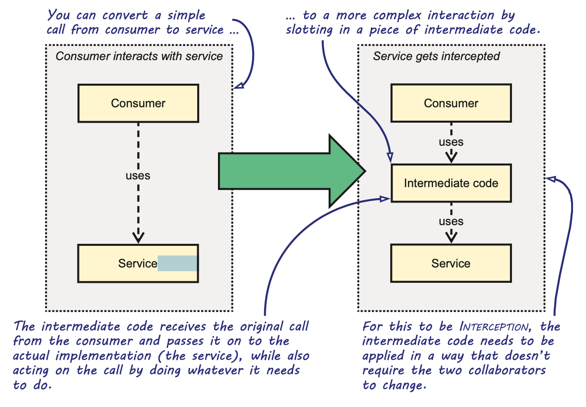
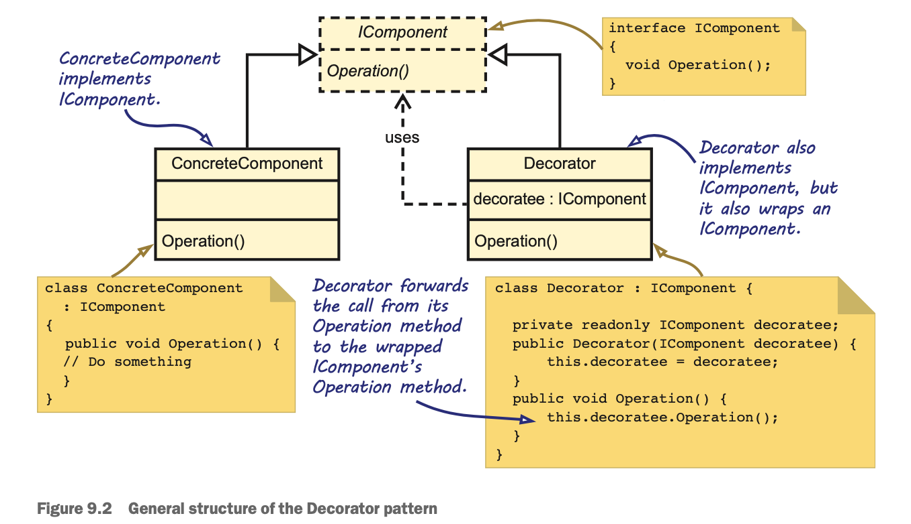
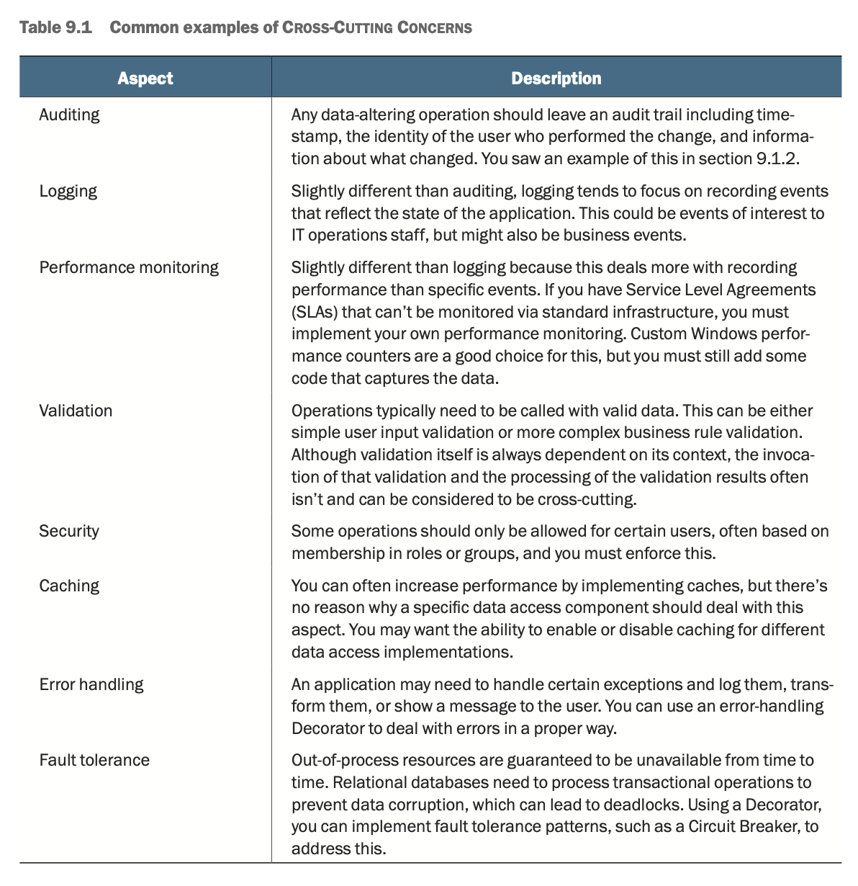
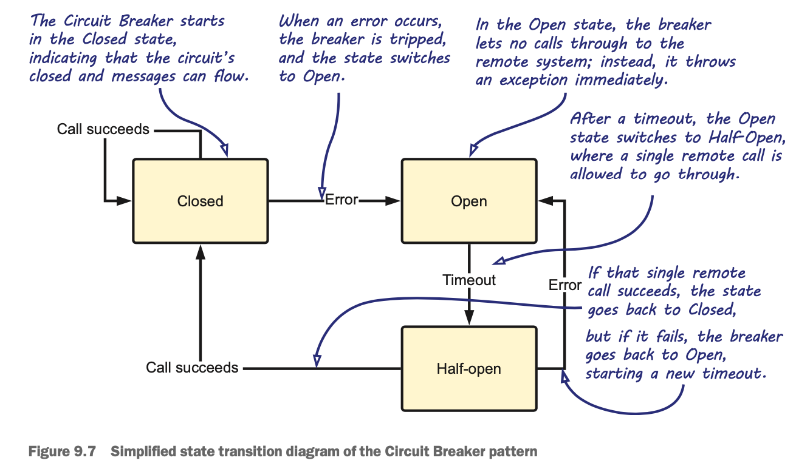

# Chapter 9 - Interception

**DEFINITION** - Cross-Cutting Concerns are aspects of a program that affect a larger part of the application. They’re often non-functional requirements. They don’t directly relate to any particular feature, but, rather, are applied to existing functionality.

The concept of Interception is simple: we want to be able to intercept the call between a consumer and a service, and to execute some code before or after the service is invoked. And we want to do so in such a way that neither the consumer nor the service has to change.

**DEFINITION** - Interception is the ability to intercept calls between two collaborating components in such a way that you can enrich or change the behavior of the Dependency without the need to change the two collaborators themselves.

For example, imagine you want to add security checks to a SqlProductRepository class. Although you could do this by changing SqlProductRepository itself or by changing a consumer’s code, with Interception, you apply security checks by inter- cepting calls to SqlProductRepository using some intermediary piece of code. In figure 9.1, a normal call from a consumer to a service is intercepted by an intermediary that can execute its own code before or after passing the call to the real service.

**IMPORTANT** - The set of software design principles and patterns around DI (such as, but not limited to, loose coupling and the Liskov Substitution Principle) are the enablers of Interception. Without these principles and patterns, it’s impossible to apply Interception.

The pattern’s intent is to “attach additional responsibilities to an object dynamically. Decorators provide a flexible alternative to subclassing for extending functionality.”

What differentiates a Decorator from any class containing Dependencies is that the wrapped object implements the same Abstraction as the Decorator. This enables a Composer to replace the original component with a Decorator without changing the consumer. The wrapped object is often injected into the Decorator declared as the abstract type—it wraps the interface, not a specific, concrete implementation. In that case, the Decorator must adhere to the Liskov Substitution Principle and treat all decorated objects equally.

### Circuit Breaker pattern

The Circuit Breaker design pattern takes its name from the electric switch of the same name. It’s designed to cut the connection when a fault occurs, preventing the fault from propagating.
In software applications, once a timeout or similar communications error occurs, it can make a bad situation worse if you keep hammering a downed system. If the remote system is swamped, multiple retries can take it over the edge — a pause might give it a chance to recover. On the calling tier, threads blocked waiting for timeouts can make the consuming application unresponsive, forcing a user to wait for an error message. It’s better to detect that communications are down and fail fast for a period of time.

The Circuit Breaker design addresses this by tripping the switch when an error occurs. It usually includes a timeout that makes it retry the connection later; this way, it can automatically recover when the remote system comes back up. Figure 9.7 illustrates a simplified view of the state transitions in a Circuit Breaker.

