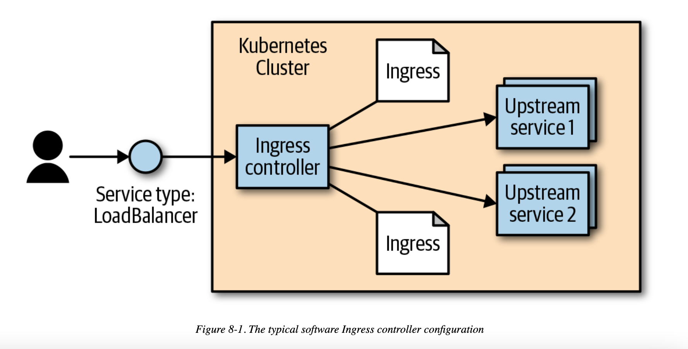

# Chapter 8 - HTTP Load Balancing with Ingress

Kubernetes calls its HTTP-based load-balancing system Ingress. Ingress is a Kubernetes-native way to implement the “virtual hosting” pattern we just discussed. One of the more complex aspects of the pattern is that the user has to manage the load balancer configuration file. In a dynamic environment and as the set of virtual hosts expands, this can be very complex. The Kubernetes Ingress system works to simplify this by (a) standardizing that configuration, (b) moving it to a standard Kubernetes object, and (c) merging multiple Ingress objects into a single config for the load balancer.

The typical software base implementation looks something like what is depicted in Figure 8-1. The Ingress controller is a software system exposed outside the cluster using a service of type: LoadBalancer. It then proxies requests to “upstream” servers. The configuration for how it does this is the result of reading and monitoring Ingress objects



## Ingress Spec Versus Ingress Controllers

While conceptually simple, at an implementation level Ingress is very different from pretty much every other regular resource object in Kubernetes. Specifically, it is split into a common resource specification and a controller implementation. There is no “standard” Ingress controller that is built into Kubernetes, so the user must install one of many optional implementations.

Users can create and modify Ingress objects just like every other object. But, by default, there is no code running to actually act on those objects. It is up to the users (or the distribution they are using) to install and manage an outside controller. In this way, the controller is pluggable.

## Installing Contour

While there are many available Ingress controllers, for the examples here we use an Ingress controller called Contour. This is a controller built to configure the open source (and CNCF project) load balancer called Envoy. Envoy is built to be dynamically configured via an API. The Contour Ingress controller takes care of translating the Ingress objects into something that Envoy can understand.

`kubectl apply -f https://j.hept.io/contour-deployment-rbac`

```
$ kubectl get -n heptio-contour service contour -o wide
NAME      CLUSTER-IP     EXTERNAL-IP          PORT(S)      ...
contour   10.106.53.14   a477...amazonaws.com 80:30274/TCP ...
```
### Configuring DNS

To make Ingress work well, you need to configure DNS entries to the external address for your load balancer. You can map multiple hostnames to a single external endpoint and the Ingress controller will play traffic cop and direct incoming requests to the appropriate upstream service based on that hostname.

## Using Ingress

```
$ kubectl run be-default \
  --image=gcr.io/kuar-demo/kuard-amd64:blue \
  --replicas=3 \
  --port=8080
$ kubectl expose deployment be-default
$ kubectl run alpaca \
  --image=gcr.io/kuar-demo/kuard-amd64:green \
  --replicas=3 \
  --port=8080
$ kubectl expose deployment alpaca
$ kubectl run bandicoot \
  --image=gcr.io/kuar-demo/kuard-amd64:purple \
  --replicas=3 \
  --port=8080
$ kubectl expose deployment bandicoot
$ kubectl get services -o wide

NAME             CLUSTER-IP    ... PORT(S)  ... SELECTOR
alpaca-prod      10.115.245.13 ... 8080/TCP ... run=alpaca
bandicoot-prod   10.115.242.3  ... 8080/TCP ... run=bandicoot
be-default       10.115.246.6  ... 8080/TCP ... run=be-default
kubernetes       10.115.240.1  ... 443/TCP  ... <none>
```

Simple Ingress example:

```
apiVersion: extensions/v1beta1
kind: Ingress
metadata:
  name: simple-ingress
spec:
  backend:
    serviceName: alpaca
    servicePort: 8080
```

### Using Hostnames

Things start to get interesting when we start to direct traffic based on properties of the request. The most common example of this is to have the Ingress system look at the HTTP host header (which is set to the DNS domain in the original URL) and direct traffic based on that header.

Example:

```
apiVersion: extensions/v1beta1
kind: Ingress
metadata:
  name: host-ingress
spec:
  rules:
  - host: alpaca.example.com
    http:
      paths:
      - backend:
          serviceName: alpaca
          servicePort: 8080
```

### Using Paths

The next interesting scenario is to direct traffic based on not just the hostname, but also the path in the HTTP request. We can do this easily by specifying a path in the paths entry. This type of scenario can be used to host multiple services on different paths of a single domain.

Example:

```
apiVersion: extensions/v1beta1
kind: Ingress
metadata:
  name: path-ingress
spec:
  rules:
  - host: bandicoot.example.com
    http:
      paths:
      - path: "/"
        backend:
          serviceName: bandicoot
          servicePort: 8080
      - path: "/a/"
        backend:
          serviceName: alpaca
          servicePort: 8080
```

When there are multiple paths on the same host listed in the Ingress system, the longest prefix matches. So, in this example, traffic starting with /a/ is forwarded to the alpaca service, while all other traffic (starting with /) is directed to the bandicoot service.

As requests get proxied to the upstream service, the path remains unmodified. That means a request to bandicoot.example.com/a/ shows up to the upstream server that is configured for that request hostname and path. The upstream service needs to be ready to serve traffic on that subpath. In this case, kuard has special code for testing, where it responds on the root path (/) along with a predefined set of subpaths (/a/, /b/, and /c/).

### Cleaning Up

```
$ kubectl delete ingress host-ingress path-ingress simple-ingress
$ kubectl delete service alpaca bandicoot be-default
$ kubectl delete deployment alpaca bandicoot be-default
```

## Advanced Ingress Topics and Gotchas

Many of the extended features are exposed via annotations on the Ingress object. Be careful, as these annotations can be hard to validate and are easy to get wrong. Many of these annotations apply to the entire Ingress object and so can be more general than you might like. To scope the annotations down you can always split a single Ingress object into multiple Ingress objects. The Ingress controller should read them and merge them together.

### Running Multiple Ingress Controllers

Oftentimes, you may want to run multiple Ingress controllers on a single cluster. In that case, you specify which Ingress object is meant for which Ingress controller using the kubernetes.io/ingress.class annotation. The value should be a string that specifies which Ingress controller should look at this object. The Ingress controllers themselves, then, should be configured with that same string and should only respect those Ingress objects with the correct annotation.

If the kubernetes.io/ingress.class annotation is missing, behavior is undefined. It is likely that multiple controllers will fight to satisfy the Ingress and write the status field of the Ingress objects.

### Multiple Ingress Objects

If you specify multiple Ingress objects, the Ingress controllers should read them all and try to merge them into a coherent configuration. However, if you specify duplicate and conflicting configurations, the behavior is undefined. It is likely that different Ingress controllers will behave differently. Even a single implementation may do different things depending on nonobvious factors.

### Ingress and Namespaces

Ingress interacts with namespaces in some nonobvious ways.

First, due to an abundance of security caution, an Ingress object can only refer to an upstream service in the same namespace. This means that you can’t use an Ingress object to point a subpath to a service in another namespace.

However, multiple Ingress objects in different namespaces can specify subpaths for the same host. These Ingress objects are then merged together to come up with the final config for the Ingress controller.

This cross-namespace behavior means that it is necessary that Ingress be coordinated globally across the cluster. If not coordinated carefully, an Ingress object in one namespace could cause problems (and undefined behavior) in other namespaces.

Typically there are no restrictions built into the Ingress controller around what namespaces are allowed to specify what hostnames and paths. Advanced users may try to enforce a policy for this using a custom admission controller. There are also evolutions of Ingress described in “The Future of Ingress” that address this problem.

### Path Rewriting

Some Ingress controller implementations support, optionally, doing path rewriting. This can be used to modify the path in the HTTP request as it gets proxied. This is usually specified by an annotation on the Ingress object and applies to all requests that are specified by that object. For example, if we were using the NGINX Ingress controller, we could specify an annotation of nginx.ingress.kubernetes.io/rewrite-target: /. This can sometimes make upstream services work on a subpath even if they weren’t built to do so.

There are multiple implementations that not only implement path rewriting, but also support regular expressions when specifying the path. For example, the NGINX controller allows regular expressions to capture parts of the path and then use that captured content when doing rewriting. How this is done (and what variant of regular expressions is used) is implementation-specific.

Path rewriting isn’t a silver bullet, though, and can often lead to bugs. Many web applications assume that they can link within themselves using absolute paths. In that case, the app in question may be hosted on /subpath but have requests show up to it on /. It may then send a user to /app-path. There is then the question of whether that is an “internal” link for the app (in which case it should instead be /subpath/app-path) or a link to some other app. For this reason, it is probably best to avoid subpaths if you can help it for any complicated applications.

## Alternate Ingress Implementations

There are many different implementations of Ingress controllers, each building on the base Ingress object with unique features. It is a vibrant ecosystem.

First, each cloud provider has an Ingress implementation that exposes the specific cloud-based L7 load balancer for that cloud. Instead of configuring a software load balancer running in a Pod, these controllers take Ingress objects and use them to configure, via an API, the cloud-based load balancers. This reduces the load on the cluster and management burden for the operators, but can often come at a cost.

The most popular generic Ingress controller is probably the open source NGINX ingress controller. Be aware that there is also a commercial controller based on the proprietary NGINX Plus. The open source controller essentially reads Ingress objects and merges them into an NGINX configuration file. It then signals to the NGINX process to restart with the new configuration (while responsibly serving existing in-flight connections). The open NGINX controller has an enormous number of features and options exposed via annotations.

Ambassador and Gloo are two other Envoy-based Ingress controllers that are focused on being API gateways.

Traefik is a reverse proxy implemented in Go that also can function as an Ingress controller. It has a set of features and dashboards that are very developer-friendly.

This just scratches the surface. The Ingress ecosystem is very active and there are many new projects and commercial offerings that build on the humble Ingress object in unique ways.

## The Future of Ingress

As you have seen, the Ingress object provides a very useful abstraction for configuring L7 load balancers⁠—but it hasn’t scaled to all the features that users want and various implementations are looking to offer.

Many of the features in Ingress are underdefined. Implementations can surface these features in different ways, reducing the portability of configurations between implementations.

Another problem is that it is easy to misconfigure Ingress. The way that multiple objects compose together opens the door for conflicts that are resolved differently by different implementations. In addition, the way that these are merged across namespaces breaks the idea of namespace isolation.

Ingress was also created before the idea of a Service Mesh (exemplified by projects such as Istio and Linkerd) was well known. The intersection of Ingress and Service Meshes is still being defined.

There are a lot of great ideas floating around the community. For example, Istio implements the idea of a gateway that overlaps with Ingress in some ways. Contour introduces a new type called IngressRoute that is a better-defined and more explicit version of Ingress inspired by other network protocols like DNS. Defining the next step for Ingress is a hard problem. It involves creating a common language that applies to most load balancers, while at the same time leaving room for innovation of new features and allowing different implementations to specialize in other directions. This is an active area of innovation in the Kubernetes community through the Network Special Interest Group.
