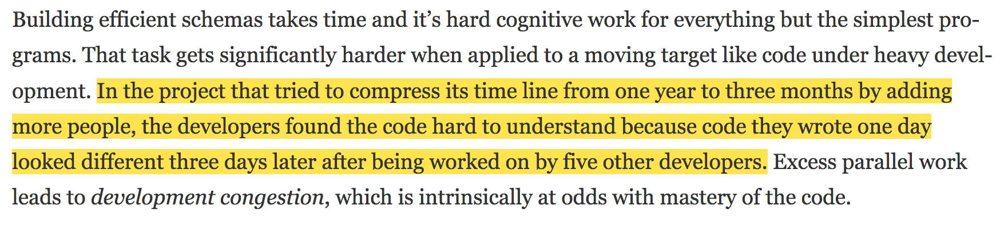

# Software Design X-Rays

## Chapter 1 - Why Technical Debt Isn't Technical

Technical debt - code that’s more expensive to maintain than it should be

Keep a decision log
    - keep track of rationale for accepting technical debt

Technical debt is frequenty misused to describe *legacy code*

Legacy code is an undesirable after-the-fact state, whereas technical debt may be a strategic choice

Just because some code is bad doesn't mean it's technical debt. It's not tech debt unless we have to pay interest on it.

Interest rate is a function of time

We need a time dimension of code to reason about the tech debt interest rate

- Challenge of programming - serving two audiences
    - the machine
        - doesn't care about style but is pedantic about content
        - can't fill in the gaps
    - programmers
        - more elaborate mental processes 
        - needs guidance to use those processes efficiently

- As we learn a topic we build mental representations of that domain
    - called a *schema*
    - used to describe the way we organize knowledge in our memory and how we use that knowledge for a particular event
    - code is built on schemas
    - schemas represent your domain expertise

Readable code is economical code

## Quality suffers with parallel development

 Organizational factors are some of the best predictors of defects:
 - The structure of the development organization is a stronger predictor of defects than any code metrics.
 - The risk that a specific commit introduces a defect increases with the number of developers who have previously worked on the modified code. 
 - These factors affect us even within a strong quality culture of peer reviews. The open source collaboration model isn’t immune to social factors such as parallel development. 

## Mine Your Organization's Collective Intelligence
- Where's the code with the highest interest rate?
- Does our architecture support the way our system evolves?
- Are there any productivity bottlenecks for interteam coordination?

**We can't prioritize technical debt based on the code alone since we lack some critical information, most prominently a time dimension and social information.** We get this from our VCS data.

We know who changed what files when. This lets us generate a knowledge map based on the contributions of each developer. This can be taken further and split up by team. We can identify coordination between teams.
