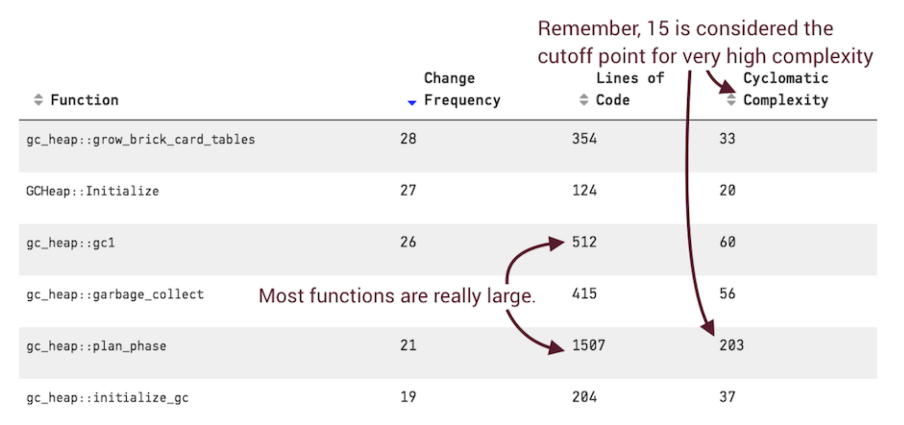

# An Extra Team Member: Predictive and Proactive Analyses

## Detect Deviating Evolutionary Patterns

Ex. - .NET Core repo -> gc.cpp file is HUGE - 37,000 lines of C++



### When Code Turns Bad

Research - root of code problems start upon class creation
- disproves notion that code starts good and becomes bad over time

Instead of doing code reviews after implementation, try 1/3 code walkthroughs (yes, 1/3 is difficult to measure)

Complicated test code is another indicator of bad code

### Identify Steep Increases In Complexity

To combat - calculate growth in complexity relative to a previous state and raise a warning each time an addition exceeds a given threshold
- Use the commit at a branch point as a reference
- Use a time window

Complexity trend warnings indicate:
- Misplaced behavior - accuumlation of responsibilities
- Excess conditional logic - most nested conditionals indicate a missing abstraction
- The code is fine - yes, this happens too

### Detect Future Hotspots

To detect rising hotspots, you can:
- Analyze based on how the code looks right now
- Analyze based on how the code looked in the past

Ex.

```
git log --before="two months ago" --format=format: --name-only \
| egrep -v '^$' | sort | uniq -c \
| sort -r > two_months_ago.txt
```

## Guide On- and Offboarding with Social Data

### Identify The Experts

Research - distributed work items take an average of two and a half times faster to complete than tasks developed by a coloacted team

Challenge - who to communicate with?
- Geographical distance makes this harder

### Power Laws Are Everywhere

Individual contributor work follows similar power distribution - Ex. Kotlin repo

### Measure Upcoming Knowledge Loss

Knowledge loss is a risk

### React to Knowledge Loss

When a developer resigns and has a notice period to work out, run an analysis to identify parts of the system where your org needs to focus to maintain knowledge

## Your Code Is Still A Crime Scene

We need to realize that software development needs to learn from other fields, such as social sciences & psychology

## Exercises

[Tomcat](https://codescene.io/projects/1713/jobs/4294/results)

[Kubernetes](https://codescene.io/projects/1823/jobs/4598/results/social/knowledge/individuals)

[Clojure](https://codescene.io/projects/1824/jobs/4597/results/social/knowledge/individuals?aspect=loss)

[Git](https://codescene.io/projects/1664/jobs/4156/results/social/knowledge/individuals?aspect=loss)


