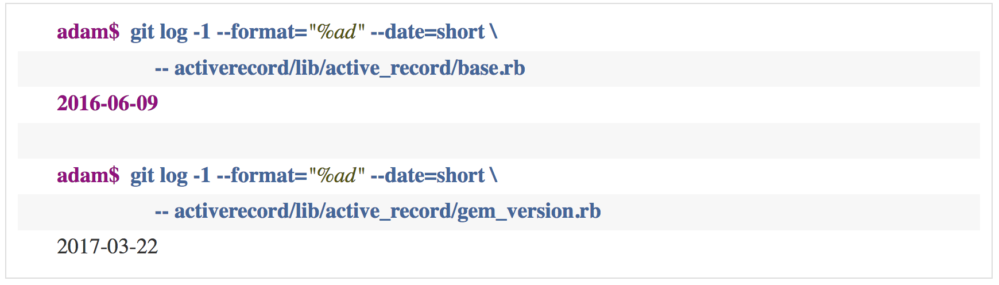
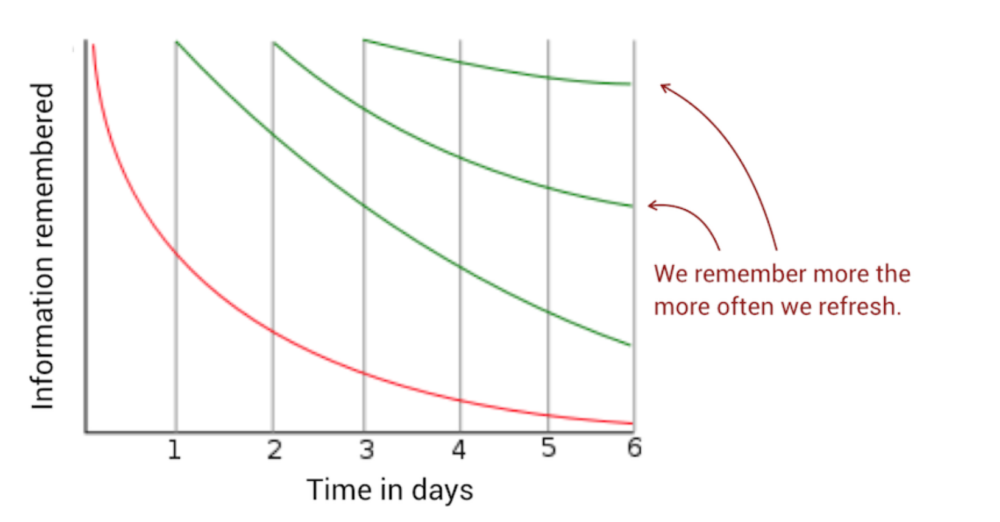

# The Principles of Code Age

## Stabilize Code by Age

Desigining code by age

1) organize code by age
2) turn stable packages into libraries; and
3) move and refactor code we fail to stabilize

Advantages to this:
- Promotes long-term memory models of code - stable packages
- Lessens cognitive load since there's less active code
- Prioritizes test suites to shorten lead times

### Calculate the Age of Code

## Three Generations of Code

We want our code to be either very recent or very old

Hermann Ebbinghaus - discovered we tend to forget things at an exponential rate

Ebbinghaus forgetting curve

Each time we revisit mid-age code, we need to relear its inner workings

*Ignorant surgery* - changing code whose original design concept we fail to understand
    - the first ignorant surgery is an invitation for others to follow
    - over time, code gets harder to understand

### Your Best Bug Fix Is Time

The risk of a new bug decreases with every day that passes. The risk of software faults declines with the age of the code

Isolating old, stable code in a library serves as a barrier to fend off ignorant surgeries

### Refactor Toward Code of Similar Age

Ex. - Google's TensorFlow library

## Refactor Your Package Structure

Code that changes at different rates within the same package is a warning sign that means either:

- Some of the code may have quality issues and we need to patch it frequently (hence its younger age)
- Individual files stabilize at different ages because they model different aspects of the problem domain

Package-level refactorings increase the cohesion of the system by being better aligned with the domain; when different modules in the same package change at different rates, there's a good chance that they represent separate concepts that we've mistaken as the same previously
    - common-closure principle

## Scale from Files to Systems
