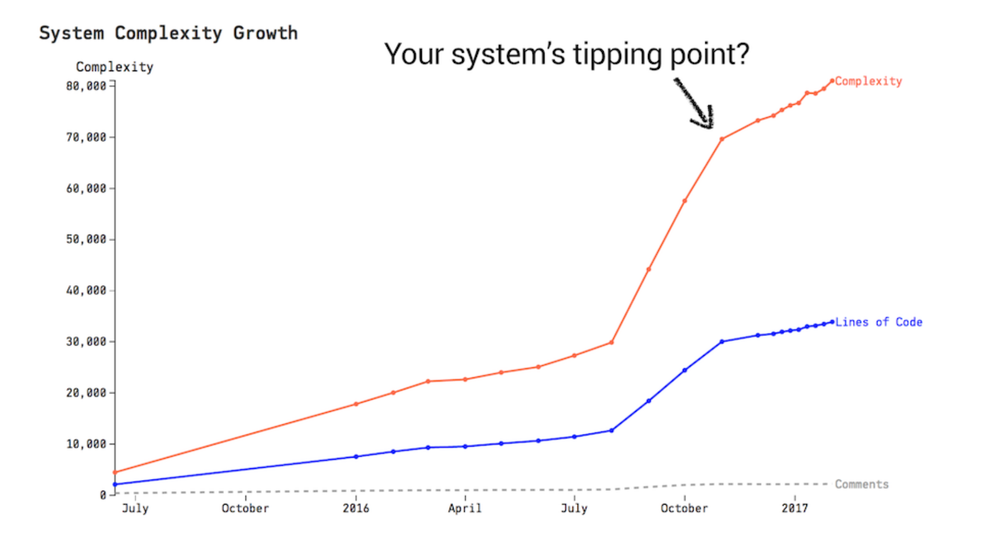
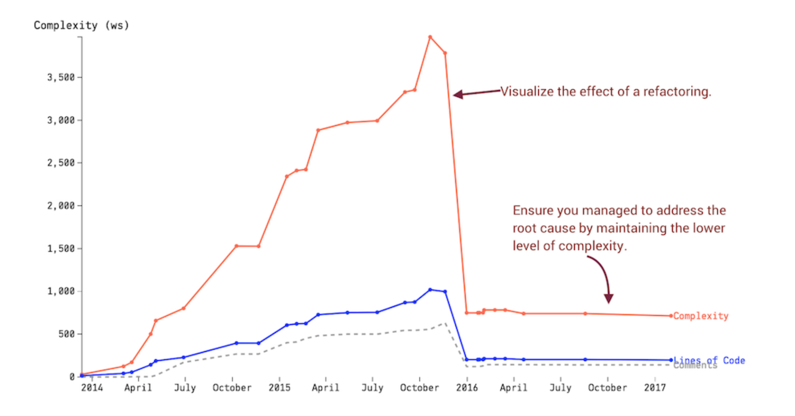

# Spot Your System's Tipping Point

## Is Software Too Hard?

Brain has lots of bottlenecks and biases
- imperfect memory
- restricted attention span
- limited multitasking abilities

This should make coding hard, but we're great at workarounds:
- abstraction
- cohesion
- good naming
- also on a system level
    - group functions in modules
    - aggregate modules into subsystems
    - subsystems compose a system

A system under development is a moving target

As a project grows beyond 12 or 15 developers, coordination, motivation, and communication issues tend to cause a significant cost overhead

### Societies Within a Software System

Ex. Linux repo has 16,241 contributors

### Raise The Abstraction Level

Social analyses on a subsystem level benefit a larger organization better

## Divide and Conquer with Architectural Hotspots

1) Identify architectural boundaries
2) Run hotspot analysis on an architectural level
3) Analyze the files in each architectural hotspot

### A Language for Specifying Architectural Boundaries

### Summarize Change Frequencies By Component

## Analyze Subsystems

Exclude all contributions in search except for ones that touch the module of interest

### Prioritize Function Hotspots and Code Clones

Ex. `intel_crtc_page_flip` has 238 lines of code, 82 commits, and a cyclomatic complexity of 52

### Look For Quick Wins

Ex. `intel_finish_page_fli_cs` and `intel_finish_page_flip_mmio` are victims of code duplication. There is very little difference in code in the two functions

### Ask The Right Questions

Ex. function missing in previous example in only one copy of the code. This may indicate a bug.

### Rinse and Repeat

This approach allows you to divide and conquer throughout the codebase

## Fight the Normalization of Deviance

Each time you accept a risk, the deviations become the new normal

Ex. You inherit a file with 15,000 lines of code. Soon it becomes 16,000 because, what's a little bit more? 16,000 becomes 17,000 and so on

### Get a Whistleblower

Calculate complexity trends:

1) Decide upon a sample interval - for example, once per month
2) Calculate a complexity trend for each file in the logical component with sample points on the dates given by the interval decided in the previous step
3) Aggregate the individual trends into a single trend

### Communicate with Nontechnical Managers

Start calculating the percentage of commits that involve your top hotspots - 10 to 15 percent is commont - to show your managers how important that code is for your ability to support new features and innovations

Demonstrate that complexity trends will slow your company down

Data buys trust

## Toward Team-Oriented Measures

High-level analyses on logical components fill an important role from a communication point of view -> helps nontechnical stakeholders

## Exercises

[Linux](https://codescene.io/projects/1740/jobs/4358/results/code/hotspots/system-map)

[Erlang](https://codescene.io/projects/1707/jobs/4289/results/files/internal-temporal-coupling?file-name=otp/erts/emulator/beam/erl_process.c)

[PhpSpreadsheet](https://codescene.io/projects/1579/jobs/4888/results/scope/system-trends/by-component)
