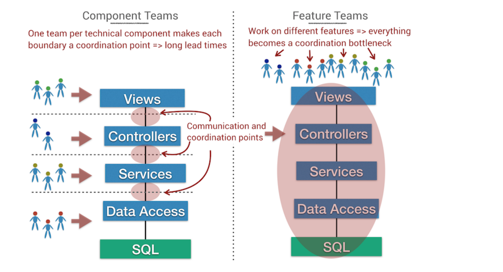
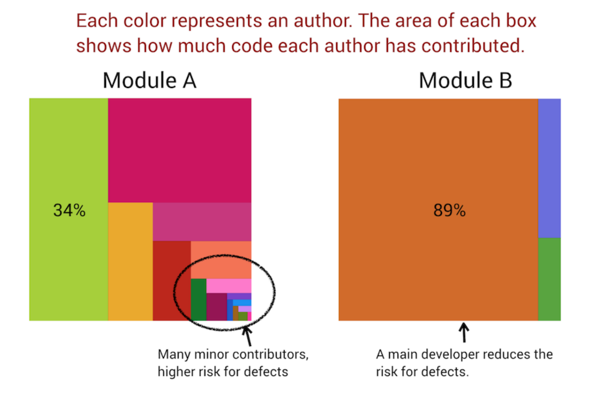
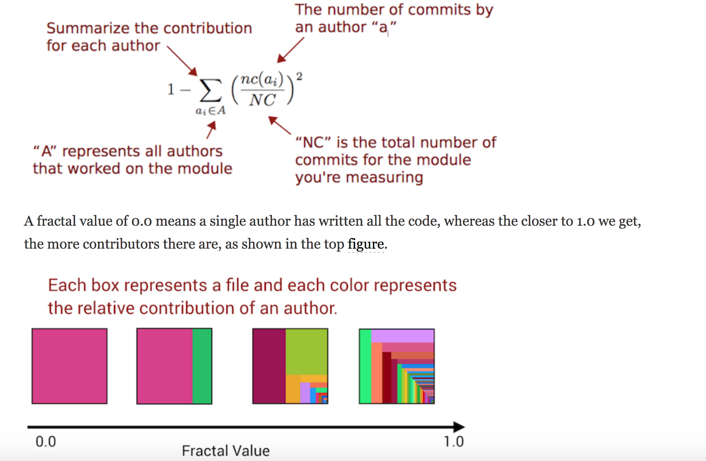
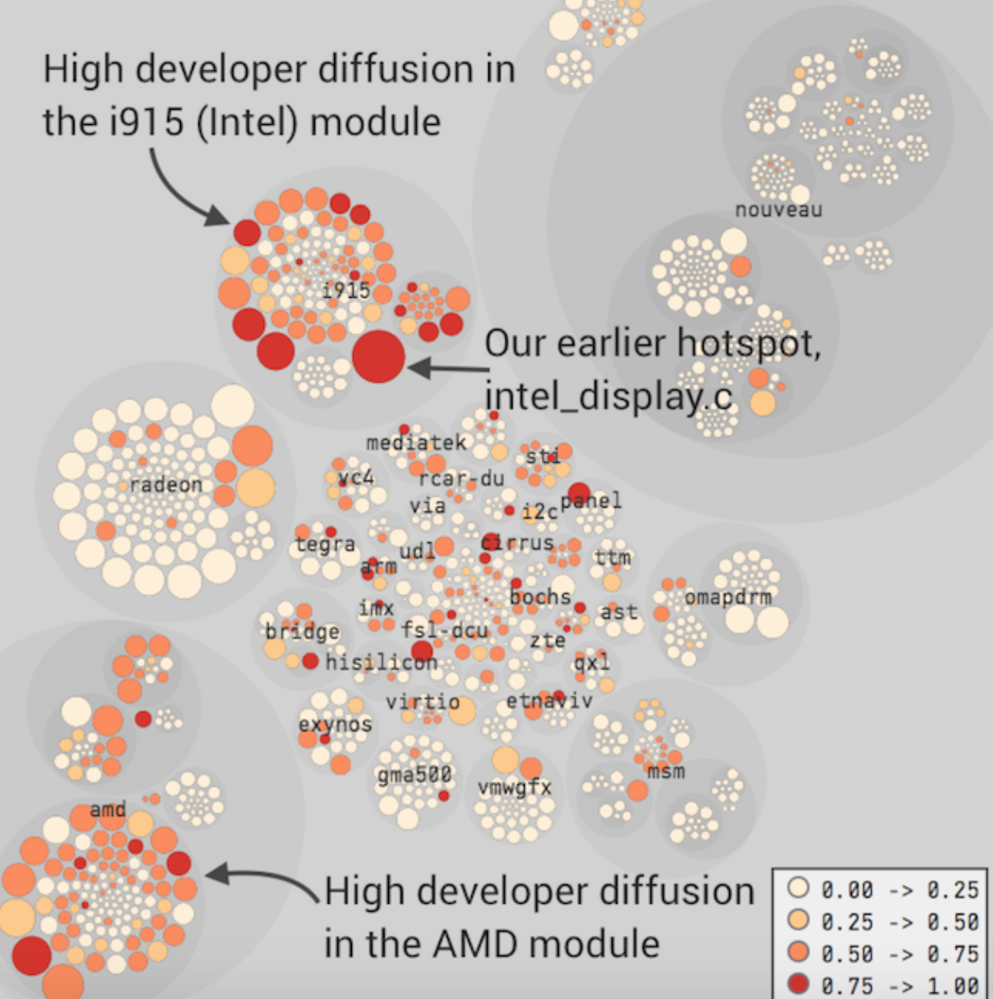

# Beyond Conway's Law

Use version-control data to measure team efficiency and detect parts of the code with excess coordination needs

## Software Architecture Is About Making Choices

Real software architecture manifests itself as a set of principles and guidelines rather than boxes and arrows

- Address collaborative model of people building the system
    - Minimize coordination and synchronization
    - Architectural boundaries serve as high-level mental chunks we can reason about independently of others
    - Measure of success -> the extent to which you can implement features without calling a grand staff meeting

### Conway's Law and Its Impact on Modularity

Modularity alone doesn't guarantee success
- Boundaries need to align with the responsibilities of the teams in the org - Core of Conway's law
- Base boundaries off the problem domain, not the solution domain
    - Architecture oriented around the problem provides natural team boundaries
- Different from solution domains
    - data access
    - controllers
    - views
    - clients
- Technical building blocks become interconnected
- Tech-oriented architecure means either:
    - All teams work in all areas of the code at the same time, or
    - Each team "owns" components, which requires massive coordination

*Congruence* - means that actual coordination needs are matched with appropriate coordination actions

## Measure Coordination Needs

Excess coordination needs -> increased lead times

### Parallel Development In Linux

Ex. Intel graphics driver
- Does it represent a coordination bottleneck?
- How many authors needed to work on it?

- Starting point - How many developers contribute to each logical component?
    - `git shortlog -s` gets each author's total commit count
    - each line represents one author, so getting the line count for a given directory can get the number of authors:
        - `git shortlog -s --after=2016-09-19 -- drivers/gpu/drm/i915/ | wc -l`
            - 55 authors
- Number of authors behind each component is just a starting point for indicating coordination needs
    - How diffused their contributions are is important
- **Study** - number of minor contributors to module has a strong positive correlation to defects
    - That alone can't tell us **why** it leads to more defects
    - Possible factors
        - Unfamiliarity with code/domain
        - Inconsistent style from newcomers

### Rank Code By Diffusion

Fractal value analysis

Diffusion example:

### React to Developer Fragmentation

Study - code written by more developers is more likely to have security flaws

When you find code with a high fractal value, you can:
- Prioritize code reviews
- Focus tests
- Replan suggested features
- Redesign for increased parallelism
    - Identify candidates for splinter refactorings
- Introduce areas of responsibility
    - Visualize developer patterns for nontechnical managers

### Watch Out for Authors with Multiple Aliases

`.mailmap` is a git file that resolves aliases

## Code Ownership and Diffusion of Responsibility

*Process loss* - just as a machine cannot operate at 100% efficiency at all times, neither can a team

Kind of process loss depends on task
- communication & collaboration overhead
- motivation loss
- other social group factors

*Diffusion of responsibility*
- The larger a group of people, the less they will participate
- We assume someone else should react and help

We need to produce personal responsibility
- privatize 

### Immutable Design

- Problem code tends to be around for a while - the design becomes immutable
    - It's usually not that hard to refactor - what happened?
    - Diffusion of responsibility
    - Ex. 20 devs in the same area of the code -> it's nobody's responsibility

### Code Ownership Means Responsibility

Not silos - a mechanism to counter the diffusion of responsibility
    - can be an individual, pair, or small team
    - others are encouraged to contribute, but owner has final say

### Provide Broad Knowledge Boundaries

Distinguish *operational boundaries* from *knowledge boundaries* between each team

### Specify a Start Date With Organizational Significance

People move between teams, new teams are formed, and old teams are abandoned

## Analyze Operational Team Boundaries

Teams are usually the coordination unit of interest, not individual developers

**Replace author names with names of teams**

Lets us identify components with excess parallel development

### Introduce New Teams to Take on Shared Responsibilities

Analyze who to make owner by looking at team contributions

## Social Groups: The Flip Side to Conway's Law

### Motivation Losses in Teams

*Social loafing* - motivational loss that may occur when we feel that the success of our team depends little on our actual effort

Minimize social loafing
- small groups
- evaluation
- leadership by example
- visibility

Don't turn knowledge maps into performance evaluations

### Us and Them: The Perils of Interteam Conflicts

Evaluating your own team and other teams different - *fundamental attribution error*

Make sure that people who work on different but related teams know each other on a personal level

### Coffee As An Organizational Tool

A 15 minute coffee break is the cheapest team-building exercise you'll ever get

## Combine Social and Technical Information
