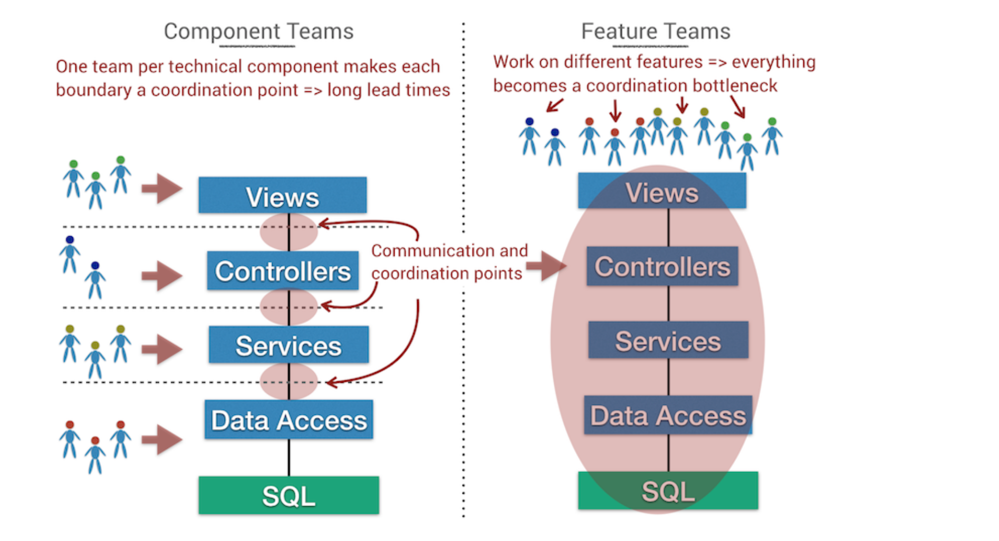

# Beyond Conway's Law

Use version-control data to measure team efficiency and detect parts of the code with excess coordination needs

## Software Architecture Is About Making Choices

Real software architecture manifests itself as a set of principles and guidelines rather than boxes and arrows

- Address collaborative model of people building the system
    - Minimize coordination and synchronization
    - Architectural boundaries serve as high-level mental chunks we can reason about independently of others
    - Measure of success -> the extent to which you can implement features without calling a grand staff meeting

## Conway's Law and Its Impact on Modularity

Modularity alone doesn't guarantee success
- Boundaries need to align with the responsibilities of the teams in the org - Core of Conway's law
- Base boundaries off the problem domain, not the solution domain
    - Architecture oriented around the problem provides natural team boundaries
- Different from solution domains
    - data access
    - controllers
    - views
    - clients
- Technical building blocks become interconnected
- Tech-oriented architecure means either:
    - All teams work in all areas of the code at the same time, or
    - Each team "owns" components, which requires massive coordination

*Congruence* - means that actual coordination needs are matched with appropriate coordination actions
