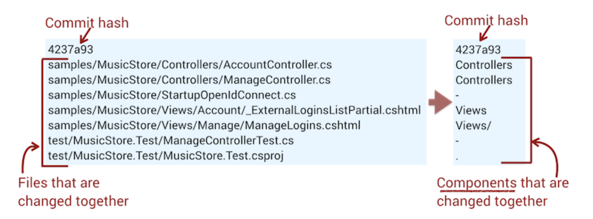
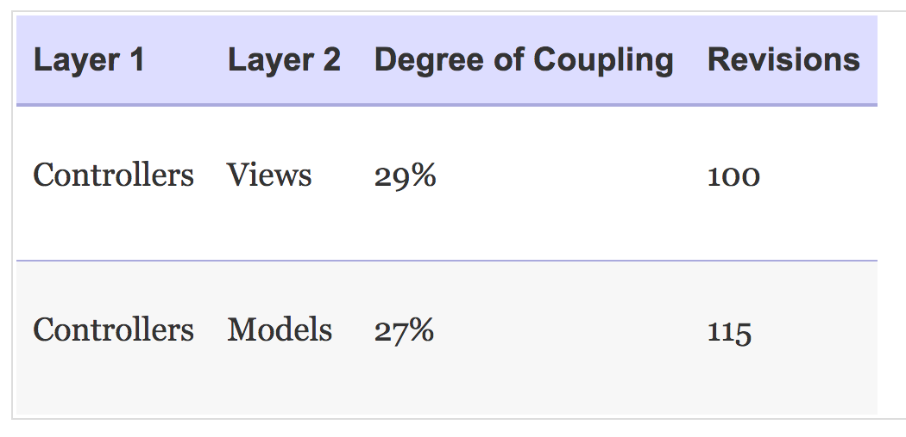

# Toward Modular Monoliths Throught the Social View of Code

Pros and cons of rewrites

Alternatives to traditional layered architectures

## Dodge the Silver Bullet

### The Trade-Off Between Architectural Refinements and Replacement Systems

Rewrites pose problems:
- Immediate legacy code - current system is in use
- Playing the catch-up game - new system needs to catch up to current
- Division of efforts - few people working on existing system
- Motivation loss - maintaining a legacy app isn't motivating

**Consider**
- Do we need to port every single feature to the new system?

### Layered Architectures and the Cost of Consistency

Layered architectures -> increased coordination needs

### Change Patterns In Layered Architectures

### A Separation of Concerns That Concern

Complexity enforces more layers than just view/model/controller

With hierarchical layers, it's hard to define clear areas of responsibility for different teams

## Monolithic Alternatives: Use Case and Feature-Centric
