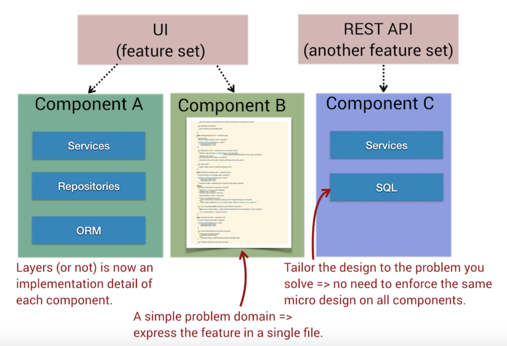
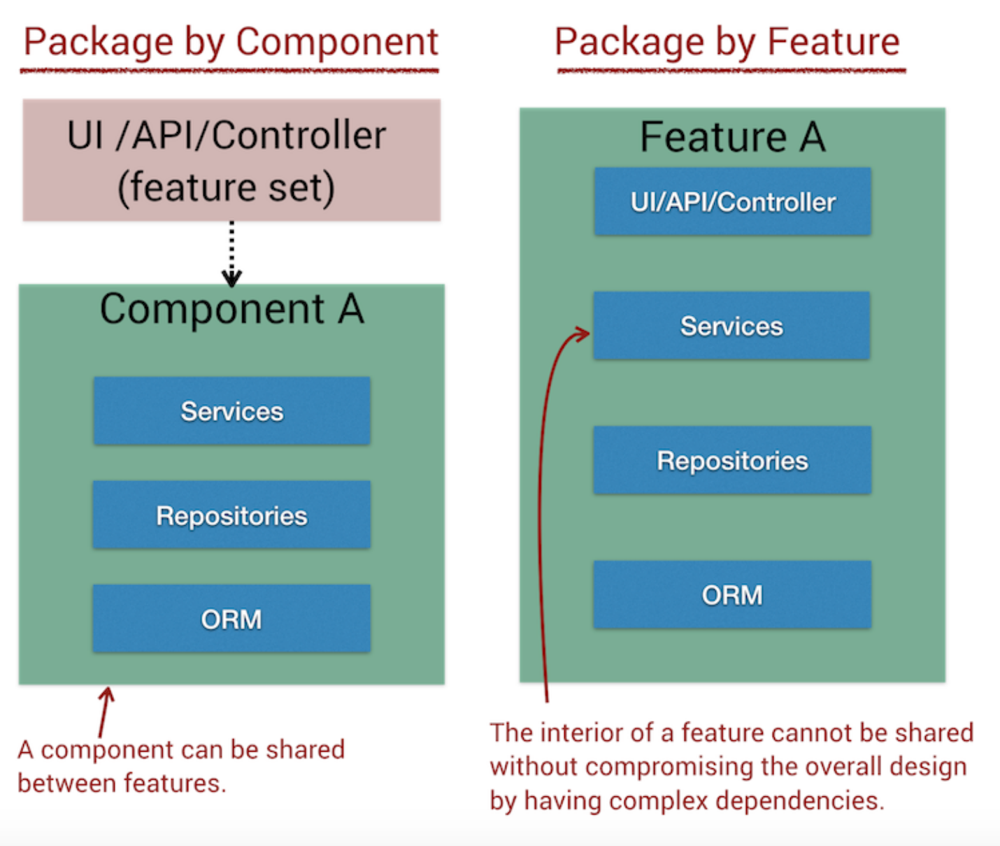
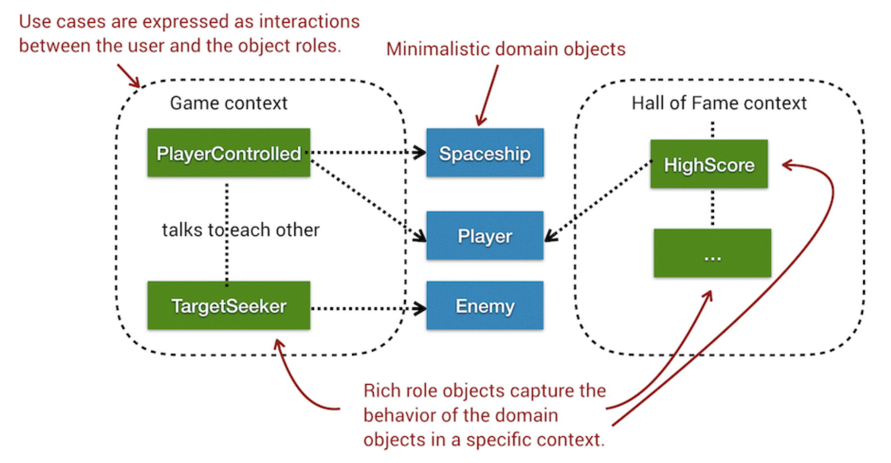
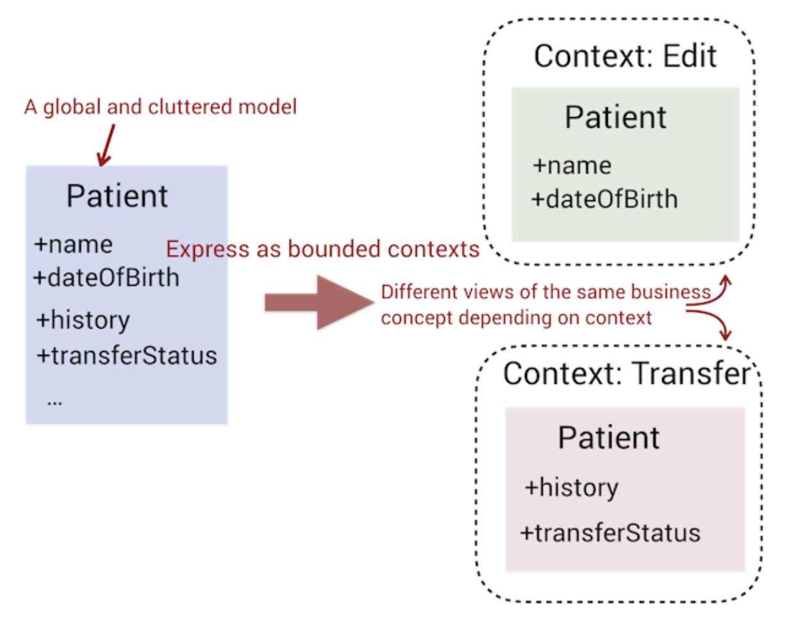
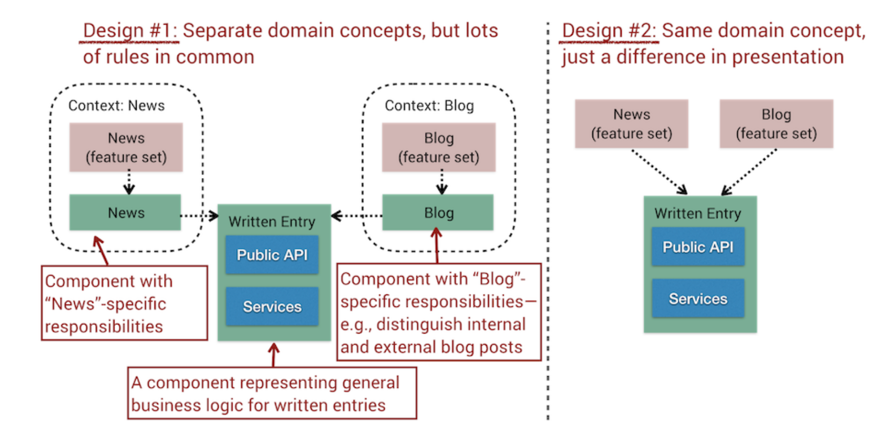
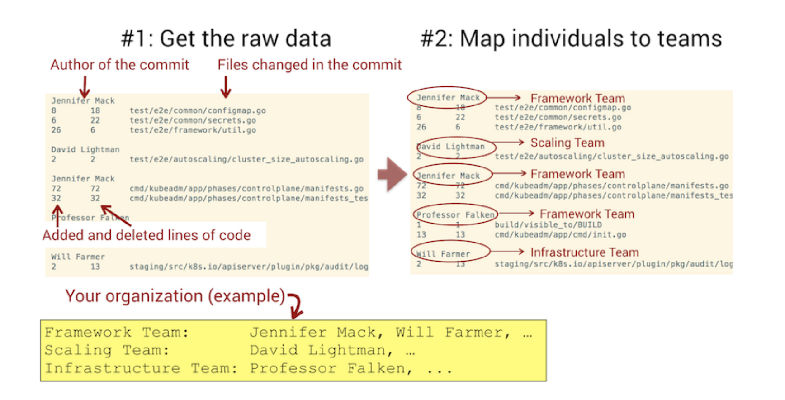

# Toward Modular Monoliths Throught the Social View of Code

Pros and cons of rewrites

Alternatives to traditional layered architectures

## Dodge the Silver Bullet

### The Trade-Off Between Architectural Refinements and Replacement Systems

Rewrites pose problems:
- Immediate legacy code - current system is in use
- Playing the catch-up game - new system needs to catch up to current
- Division of efforts - few people working on existing system
- Motivation loss - maintaining a legacy app isn't motivating

**Consider**
- Do we need to port every single feature to the new system?

### Layered Architectures and the Cost of Consistency

Layered architectures -> increased coordination needs

### Change Patterns In Layered Architectures

### A Separation of Concerns That Concern

Complexity enforces more layers than just view/model/controller

With hierarchical layers, it's hard to define clear areas of responsibility for different teams

## Monolithic Alternatives: Use Case and Feature-Centric

Vast amount of space between monolith and microservice

You don't need to go full microservice to rescue a legacy codebase

### Package By Components and Features

*Package by component*
- Slice intertwined layers into coarse-grained components
- Make components an architectural building block that contains application logic and data-access logic, if needed
- Presentation layers and APIs are then built on top of the components

*Package by feature*
- Domain-oriented approach
- Each user-facing feature becomes a high-level building block
- UI is part of each feature, unlike in *Package by component*

*Data, context, and interaction*
- Clear separation between data/domain model (what the system is) and its features (what the system does)
- Separates data objects from feature-specific behaviors
    -Expressed in *object roles*
    - Differnt use cases express their context by combining specific object roles

## Discover Bounded Contexts Through Change Patterns

Change coupling can be used to find *bounded contexts*

Context specific models are preferred over global, shared data model

### Look For Clusters of Cochanging Files

## The Perils of Feature Teams

Ex. 12 different teams had to work across all components

### Build Team Knowledge Maps

Based on amount of code contributed by each team within analysis period

### Not All Teams Are Equal

Dangers of a "maintenance team"
- Motivation loss
- Low in-group cohesion - work is reactive and spread across unrelated bug fixes
- Broken feedback loops - bugs provide an opportunity to learn for the implementing team; when they rush to the next feature, they miss out on this
- Blurred lines - invitation to diffusion of responsibility

Common response is "gatekeeper" or "architect"
- *Amdahl's law* - theoretical speedup is limited by the serial part of the program
    - Gatekeep acts as serial part
- Code-reviewer fatigue becomes real

Let each team act as the gatekeeper of its own code

Your teams will never become cross-functional if they depend on someone else to approve their code

## Exercises

[nopCommerce](https://codescene.io/projects/1593/jobs/3920/results/code/temporal-coupling/by-commits)

[PhpSpreadsheet](https://codescene.io/projects/1579/jobs/3839/results/code/temporal-coupling/by-commits)
