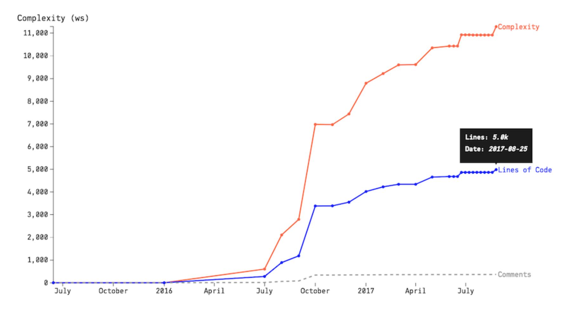

# Systems of Systems: Analyzing Multiple Repositories and Microservices

## Analyze Code in Multiple Repositories

Microservices
- loosely coupled
- independently deployable
- execute in their own environment
- supports autonomous teams that can work independently on different services

Microservices have to center around features and business capabilities

If systems represent technical responsibilities like "persistence" or "validation", consider it a warning sign

### Detect Services With Low Cohesion

Microservices - a high-discipline architecture
- There's a direct cost to introducing new design elements

Two choices for defining logical components in microservice analysis:
1) All services are in a single Git repo
2) Services are in separate Git repos

Looking at lines of code along with change frequency allows us to analyze microservice hotspots:

`git rev-list --count HEAD` - a shorthand command to aggregate all contributions to a repo

### React to Your Findings

When you find an architectural hotspot, you can:
1) Run hotspot analysis on the file level
2) Split a microservice into multiple services - use change coupling techniques to find bounded contexts

## Compare Hotspots Across Repositories
