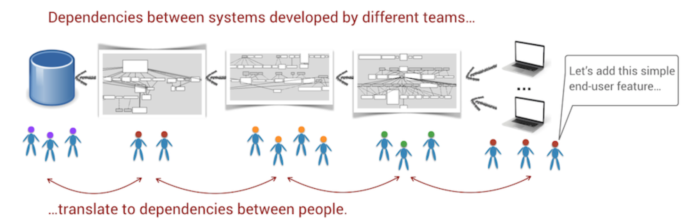
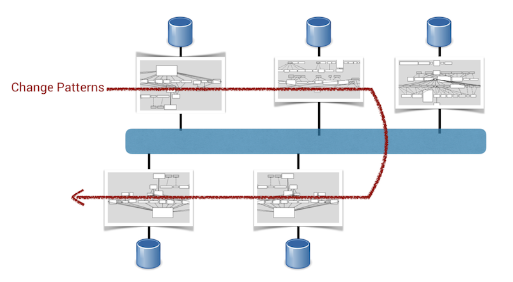

# Systems of Systems: Analyzing Multiple Repositories and Microservices

## Analyze Code in Multiple Repositories

Microservices
- loosely coupled
- independently deployable
- execute in their own environment
- supports autonomous teams that can work independently on different services

Microservices have to center around features and business capabilities

If systems represent technical responsibilities like "persistence" or "validation", consider it a warning sign

### Detect Services With Low Cohesion

Microservices - a high-discipline architecture
- There's a direct cost to introducing new design elements

Two choices for defining logical components in microservice analysis:
1) All services are in a single Git repo
2) Services are in separate Git repos

Looking at lines of code along with change frequency allows us to analyze microservice hotspots:

`git rev-list --count HEAD` - a shorthand command to aggregate all contributions to a repo


### React to Your Findings

When you find an architectural hotspot, you can:
1) Run hotspot analysis on the file level
2) Split a microservice into multiple services - use change coupling techniques to find bounded contexts

## Compare Hotspots Across Repositories

When analyzing different repositories, give files a *virtual root* based on the name of the git repo to avoid conflicts with common files, such as `README.md` files or `makefile`s.

```
git log --format=format: --name-only \
| egrep -v '^$' \
| sed -e 's/^/deck\//' \
| sort | uniq -c | sort -r
```

### Communicate Across the Organization

Hotspot maps make great visuals when communicating with nontechnical managers

## Track Change Patterns in Distributed Systems



### Use Logical Change Sets to Group Commits

*Logical change set* - way to group different commits together
- Proximity in time and organization
- Task or ticket identifiers

Using ticket IDs to group minimize risk of false positives

### Detect Implicit Dependencies Between Microservices

Ex. We see that Groovy file in clouddriver repo changes together with two JS files from the frontend repo

### Balance Monolith UIs

A single UI is at odds with team autonomy

Ways to reduce conflict:
- Composite UI - client code specifies templates that are then populated by view models from services
- Back end for front end (BFF) - smaller monolithic UIs, but a back-end service is dedicated to each user experience, e.g. one for mobile and one for web
- Let backend provide metadata to drive presentation

### Detect Microservices Shotgun Surgery

Coupling between microservices is basically shotgun surgery on an architectural scale



Root causes for microservices shotgun surgery:
1) Services share code that itself isn't stable from an evolutionary POV
2) Protocol design is hard to get right -> services turn into leaky abstractions
3) Same team is responsible for multiple services -> becomes easier to send info between services that, logically, represent different concepts

### Optimize for Sociotechnical Congruence Across Boundaries

When you detect dependencies between code owned by different teams:
1) Live with it
2) Transfer ownership - move so that they are owned by same team
3) Redefine the protocols - fix accidental implementation detail exposure
4) Collapse the services - are they logically the same? Then collapse them

## Measure Technical Sprawl

Lehman's Laws
- Need for *conservation of familiarity* - everyone involved with lifecycle of a system must maintain a working knowledge of the system's behavior and content

Reasons for diminishing knowledge
- High turnover of personnel
- Excessive growth of codebase

### Freedom Isn't Free

*Technical sprawl* - consequences of unrestricted technology adoption

Danger of technical sprawl - folks with specialized knowledge leave the company

### Measure Programming-Langugae Sprawl

`cloc` can count lines of code by language

### Calculate a Technical Sprawl Index

Like ranking code by diffusion, we can calculate technical sprawl with the same formula
- 0.0 means single programming language
- closer to 1.0 means greater sprawl

cloc . --csv --quiet --report-file=orca_loc.csv

## Distribution Won't Cure the Dependency Blues

Even though services are distributed, logical dependency is still there

## Exercises

[Spinnaker](https://codescene.io/projects/1650/jobs/4074/results/code/temporal-coupling/between-repos)

[Git](https://codescene.io/projects/1664/jobs/4156/results/code/refactoring-targets)
